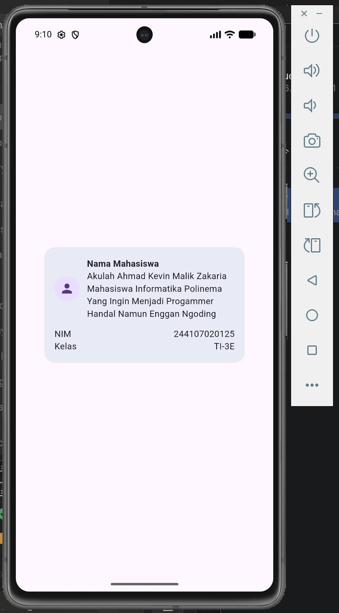

# Laporan Praktikum Pemrograman Mobile - Week 2
## Declarative UI & Responsive Design di Flutter

---

## Identitas Mahasiswa

* **Nama:** Ahmad Kevin Malik Zakaria  
* **NIM:** 244107020125  
* **Kelas:** TI-3E  
* **Mata Kuliah:** Pemrograman Mobile  
* **Topik:** Declarative UI & Responsive Design di Flutter  

---

## Struktur File & Cara Menjalankan

### Struktur Folder Proyek

```text
02-week-2-declarative-ui-responsive-design/
├── lib/
│   └── main.dart            # Kode utama aplikasi Dashboard Akademik
├── test/
│   └── widget_test.dart     # Pengujian widget UI otomatis
├── screenshots/             # Bukti eksekusi & tangkapan layar praktikum
│   ├── image.png
│   ├── image copy.png
│   ├── image copy 2.png
│   ├── image copy 3.png
│   ├── image copy 4.png
│   ├── image copy 5.png
│   ├── image copy 6.png
│   ├── image copy 7.png
│   ├── image copy 8.png
│   ├── image copy 9.png
│   ├── image copy 10.png
│   ├── image copy 11.png
│   ├── image copy 12.png
│   └── image copy 13.png
├── pubspec.yaml             # Konfigurasi proyek & dependensi Flutter
└── README.md                # Laporan praktikum komprehensif
```

### Perintah Dasar Flutter

1. **Mengunduh Dependensi:**
   ```bash
   flutter pub get
   ```
   *Fungsi:* Mengunduh dan mengonfigurasi seluruh paket pustaka yang terdaftar di dalam `pubspec.yaml`.

2. **Analisis Kode Statis:**
   ```bash
   flutter analyze
   ```
   *Fungsi:* Memeriksa kesalahan sintaksis, peringatan linter, atau potensi bug pada kode Dart sebelum dijalankan.

3. **Menjalankan Pengujian Otomatis:**
   ```bash
   flutter test
   ```
   *Fungsi:* Memvalidasi fungsionalitas komponen UI dan logika aplikasi secara otomatis melalui skrip di folder `test/`.

---

## Langkah-Langkah Praktikum

### Langkah 1-2: Kartu Profil Mahasiswa & Penanganan Overflow
Membuat komponen kartu profil mahasiswa dengan mengombinasikan widget layout dasar Flutter:
* **`Container`:** Digunakan sebagai pembungkus utama dengan *padding*, *margin*, dan *decoration* (`BoxDecoration`) untuk memberikan warna latar belakang `secondaryContainer` dan sudut melengkung (*border radius* 16dp).
* **`Row`:** Menyusun elemen foto profil (`CircleAvatar`) dan informasi teks secara horizontal.
* **`Column`:** Menyusun informasi teks (Nama Mahasiswa, NIM, dan Kelas) secara vertikal di sebelah kanan avatar.
* **`Expanded`:** Membungkus `Column` di dalam `Row` agar teks dapat menyesuaikan sisa lebar ruang yang tersedia secara fleksibel tanpa memicu *right overflow*.

#### Bukti Eksekusi Langkah 1-2:

| Sebelum `Expanded` (Right Overflow Error) | Setelah Dipasang `Expanded` (Teks Ter-wrap Rapi) |
| :---: | :---: |
|  |  |

| Tampilan Kartu Profil Dasar | Penambahan Info Kontak Mahasiswa |
| :---: | :---: |
|  |  |

---

### Langkah 4: Dashboard Responsif
Mengimplementasikan tata letak yang beradaptasi dengan ukuran layar perangkat menggunakan widget `LayoutBuilder`:
* `LayoutBuilder` membaca batasan lebar layar yang tersedia melalui `constraints.maxWidth`.
* **Kriteria Breakpoint:**
  * **Layar Lebar (`maxWidth >= 700px`):** Tampilan grid kartu akademik diatur menjadi **2 kolom** (`crossAxisCount = 2`).
  * **Layar Sempit (`maxWidth < 700px`):** Tampilan grid kartu akademik diatur menjadi **1 kolom** (`crossAxisCount = 1`).

#### Bukti Eksekusi Layar Responsif (Mode Gelap):

| Tampilan Layar Sempit (< 700px - 1 Kolom) | Tampilan Layar Lebar (Landscape >= 700px - 2 Kolom) |
| :---: | :---: |
|  |  |

---

### Langkah 5-6: StatefulWidget, Switch, & Aksesibilitas (A11y)
* **Konsep *Lifting State Up*:** Memisahkan pengelola *state* tema (`isDark`) pada widget `DashboardApp` (`StatefulWidget`) dari widget tampilan `DashboardPage` (`StatelessWidget`). `DashboardPage` menerima nilai `isDark` dan meneruskan perubahan melalui fungsi *callback* `onDarkChanged`.
* **`CupertinoSwitch`:** Dipasang pada `AppBar` untuk memungkinkan pengguna mengubah mode tema aplikasi (Light Mode / Dark Mode) secara interaktif.
* **Aksesibilitas (`Semantics`):** Membungkus `CupertinoSwitch` dengan widget `Semantics(label: 'Tombol pengubah tema gelap dan terang')` untuk memberikan deskripsi suara yang ramah pengguna *screen reader* (TalkBack / VoiceOver).

---

### Langkah 7: Hasil Tugas Utama & Refactoring `ProfileHeader`

#### Rangkuman Ketentuan & Fitur Aplikasi

| Fitur / Ketentuan | Status | Deskripsi Implementasi |
| :--- | :---: | :--- |
| **Profil Mahasiswa** | Terpenuhi | Menampilkan Avatar, Nama, NIM, dan Kelas menggunakan `ProfileHeader` |
| **Kartu Akademik** | Terpenuhi | 4 Kartu: *Assignments*, *Attendance*, *Portfolio*, dan *Current week* |
| **Responsif (Breakpoint)** | Terpenuhi | `LayoutBuilder` memisahkan tampilan 1 kolom (<700px) dan 2 kolom (>=700px) |
| **Tema Terang & Gelap** | Terpenuhi | Sakelar pengganti tema dengan `MaterialApp` `themeMode` dinamis |
| **Aksesibilitas (A11y)** | Terpenuhi | Integrasi label `Semantics` pada komponen switch pengubah tema |

#### Bukti Hasil Eksekusi Layar Aplikasi Lengkap:

| Mode Terang (Portrait - 1 Kolom) | Mode Terang (Landscape - 2 Kolom) |
| :---: | :---: |
|  |  |

---

### Langkah 8: AI Prompt Challenge
Dalam proses eksplorasi analisis tata letak, responsivitas, dan aksesibilitas dashboard, berikut adalah 3 *prompt* tantangan yang diajukan beserta hasil analisis ringkas berdasarkan kode `main.dart`:

#### 1. Perbandingan Layout `GridView` vs `LayoutBuilder` + `Column`
* **Prompt:** *"Bandingkan dua tata letak dashboard akademik untuk Flutter: versi GridView dan versi LayoutBuilder + Column. Jelaskan trade-off responsif dan aksesibilitasnya."*
* **Hasil Analisis (Sesuai Kode):**
  * **`GridView` (Digunakan di `main.dart`):** Sangat efisien untuk menyusun kartu homogen secara rapi (2 kolom saat lebar $\ge 700\text{px}$ dan 1 kolom saat $< 700\text{px}$). Trade-off: Menggunakan `childAspectRatio: 2.6` yang berisiko memicu *text overflow* jika font diperbesar ekstrem pengguna.
  * **`LayoutBuilder` + `Column` (`SingleChildScrollView`):** Lebih adaptif terhadap *Dynamic Type* (skala font OS besar) karena tinggi kontainer menyesuaikan isi teks (*intrinsic height*), namun memerlukan susunan `Row`/`Column` manual untuk multi-kolom.

#### 2. Penyebab `Expanded` Menyebabkan Overflow di Dalam `Row`
* **Prompt:** *"Jelaskan kapan penggunaan Expanded justru menyebabkan overflow di dalam Row, beri contoh kode yang gagal dan perbaikannya."*
* **Hasil Analisis (Sesuai Kode):**
  * **Penyebab:** `Expanded` pada `Row` hanya membatasi lebar sisa (*horizontal constraint*). `Expanded` memicu error jika berada di dalam kontainer berukuran tak terbatas (*unbounded width* seperti scrollview horizontal) atau jika konten vertikal di dalamnya melebihi tinggi `Row`.
  * **Contoh Kasus Pada Kode `ProfileHeader`:**
    ```dart
    // ❌ GAGAL: Tanpa Expanded, teks panjang memicu RIGHT OVERFLOW BY 623 PIXELS
    Row(children: [
      CircleAvatar(...),
      Column(children: [ Text('Nama Mahasiswa Panjang...'), Text('NIM/Kelas') ])
    ])

    // ✅ PERBAIKAN: Membungkus Column dengan Expanded (Diimplementasikan pada ProfileHeader)
    Row(children: [
      CircleAvatar(...),
      Expanded(child: Column(children: [ Text('Nama Mahasiswa Panjang...'), Text('NIM/Kelas') ]))
    ])
    ```

#### 3. Verifikasi Layar <600px, Aksesibilitas, & Stabilitas Widget
* **Prompt:** *"Periksa kembali rekomendasi layout di atas: apakah tetap responsif di bawah 600px, apakah mengurangi aksesibilitas, dan apakah ada widget yang tidak tersedia di Flutter stabil saat ini?"*
* **Hasil Analisis (Sesuai Kode):**
  * **Responsivitas (<600px):** Tetap responsif. Kondisi `constraints.maxWidth >= 700 ? 2 : 1` otomatis mengubah tampilan menjadi 1 kolom penuh pada smartphone (<600px).
  * **Aksesibilitas:** Tidak mengurangi aksesibilitas. Komponen `CupertinoSwitch` di-wrap dengan `Semantics(label: 'Tombol pengubah tema...')` dan teks menggunakan `Theme.of(context).textTheme` yang mendukung kontras warna otomatis.
  * **Ketersediaan Widget:** Semua widget (`LayoutBuilder`, `GridView`, `Column`, `Expanded`, `Semantics`, `CupertinoSwitch`) 100% merupakan widget **stabil** bawaan Flutter SDK.

---

### Langkah 9: Refactoring Challenge
Melakukan *clean code refactoring* pada bagian kartu profil:
1. **Ekstraksi Widget `ProfileHeader`:** Mengabstraksi komponen profil dari `DashboardPage` menjadi `StatelessWidget` tersendiri bernama `ProfileHeader` agar *reusable* dan mudah dirawat.
2. **Penghilangan Gaya Teks Hardcoded:** Menghapus properti statis seperti `fontSize: 16` dan `fontWeight` manual.
3. **Pemanfaatan Tema Dinamis:** Menggantikan gaya teks dengan tipografi bawaan tema:
   * **Nama Mahasiswa:** `Theme.of(context).textTheme.titleLarge`
   * **NIM & Kelas:** `Theme.of(context).textTheme.bodyMedium`
   * **Warna Teks:** Menggunakan `colorScheme.onSecondaryContainer` agar otomatis beradaptasi dengan warna latar belakang saat berganti antara Light Mode dan Dark Mode.

---

### Langkah 10: Testing Dasar

Memperbarui target pengujian pada file `test/widget_test.dart` dari `MyApp` default menjadi `DashboardApp`:

```dart
dart
import 'package:flutter_test/flutter_test.dart';
import 'package:week02_declarative_ui/main.dart'; 

void main() {
  testWidgets('Test UI Dashboard Mahasiswa', (WidgetTester tester) async {
    await tester.pumpWidget(const DashboardApp());

    expect(find.text('Student Dashboard'), findsOneWidget);
    expect(find.text('Ahmad Kevin Malik Zakaria'), findsOneWidget);
    expect(find.text('Assignments'), findsOneWidget);
  });
}
```

#### Bukti Eksekusi Terminal `flutter analyze` & `flutter test`:

| Sebelum Diperbaiki (Issue / Error Test) | Setelah Diperbaiki (Sukses / Passed) |
| :---: | :---: |
| **`flutter analyze` Error:**<br> | **`flutter analyze` Sukses:**<br> |
| **`flutter test` Error:**<br> | **`flutter test` Sukses:**<br> |

---

## 💬 Refleksi Akademis

### Q1: Apa perbedaan cara berpikir *imperative* dan *declarative* saat membangun UI?
**Jawaban:**  
Imperative berfokus pada **bagaimana** mengubah UI langkah demi langkah (mengambil elemen lalu memodifikasi manual). Declarative berfokus pada **apa** yang harus ditampilkan UI berdasarkan *state* saat ini. Di Flutter, UI adalah fungsi dari *state* ($\text{UI} = f(\text{State})$); ketika *state* (seperti `isDark`) berubah, UI otomatis membangun ulang dirinya sendiri.

### Q2: Kapan `Expanded` membantu dan kapan penggunaannya justru menghasilkan *layout error*?
**Jawaban:**  
`Expanded` membantu mendistribusikan sisa ruang kosong secara proporsional dalam `Row`/`Column` untuk mencegah *overflow*. Namun, `Expanded` akan menyebabkan *error* (*unbounded constraints*) jika diletakkan di dalam *parent* yang ruangnya tidak terbatas (misalnya di dalam `SingleChildScrollView` horizontal tanpa batasan lebar pasti).

### Q3: Bagaimana *breakpoint* dan *theme* memengaruhi pengalaman pengguna?
**Jawaban:**  
*Breakpoint* memastikan aplikasi beradaptasi dengan mulus di berbagai ukuran layar (HP maupun desktop) sehingga ruang layar dimanfaatkan optimal. *Theme* dinamis (Light/Dark) mengurangi ketegangan mata pengguna, menjaga konsistensi warna komponen (seperti pada `ProfileHeader`), dan memberikan nuansa visual yang lebih *native* dan inklusif.

### Q4: Apa yang Anda verifikasi dari rekomendasi AI setelah tugas inti selesai?
**Jawaban:**  
Setelah AI menyarankan *refactoring* menjadi `ProfileHeader`, saya memverifikasi bahwa struktur kode (*widget tree*) menjadi lebih bersih, memastikan atribut *hardcode* telah sepenuhnya terganti oleh `Theme.of(context)`, memastikan widget bisa dipanggil ulang tanpa *error*, dan memastikan visual di layar tetap identik tanpa ada tata letak yang rusak saat tema diubah.
