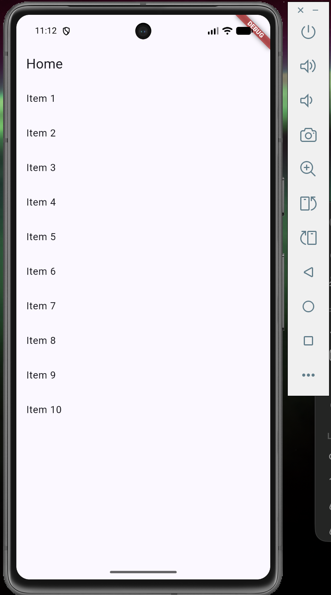

# Week 3 — Navigation & State Management (GoRouter + Riverpod)

Laporan praktikum minggu 3 mata kuliah Mobile Programming.

Nama: Ahmad Kevin Malik
NIM: 244107020125

## Tujuan

- Memahami konsep navigasi, route, dan perbedaan Navigator 1.0 dengan GoRouter.
- Menerapkan navigasi multi-page dengan GoRouter (passing argument & deep link).
- Memahami alasan state management diperlukan dan cara kerja Riverpod (Provider, ConsumerWidget, Notifier).
- Menggunakan AsyncValue untuk menangani state loading, error, dan success.
- Membangun aplikasi ToDo dengan navigasi dan Riverpod, lalu memverifikasinya dengan widget test.

## Stack Teknologi

- Flutter (Material 3)
- [go_router](https://pub.dev/packages/go_router) — navigasi deklaratif
- [flutter_riverpod](https://pub.dev/packages/flutter_riverpod) — state management
- flutter_test — unit & widget test

## Langkah Pengerjaan

### Langkah 1 — Menambahkan dependency

Menambahkan paket yang dibutuhkan ke project: `go_router` untuk navigasi deklaratif dan `flutter_riverpod` untuk state management.

```bash
flutter pub add go_router
flutter pub add flutter_riverpod
```


*Terminal: instalasi go_router 18.0.1 berhasil.*


*Terminal: instalasi flutter_riverpod 3.4.3 berhasil.*

### Langkah 2 — Praktikum 1: Aplikasi multi-page dengan GoRouter

Membuat router di `lib/main.dart` dengan `MaterialApp.router` (bukan `MaterialApp` biasa). Didefinisikan dua route: `/` untuk `HomePage` (list 10 item) dan `/detail/:id` untuk `DetailPage` yang menerima **path parameter** `id` lewat `state.pathParameters`. Perpindahan halaman memakai `context.go('/detail/${index + 1}')`.

Hasil: saat item di-tap, path URL berubah mengikuti layar aktif, dan path `/detail/1` bisa dibuka langsung tanpa melewati Home (deep link) — keunggulan router deklaratif dibanding Navigator 1.0.


*Halaman Home dengan 10 item. Setiap item di-tap akan menuju `/detail/:id`.*


*Halaman Detail menampilkan id dari path parameter. Tombol back sistem kembali ke Home dan path berubah sesuai layar.*

### Langkah 3 — Praktikum 2: Aplikasi ToDo dengan Riverpod

Membungkus root aplikasi dengan `ProviderScope`, lalu membuat state di `lib/providers/todo_provider.dart`:

- Class `Todo` (immutable, ada `copyWith`).
- `TodoListNotifier` (pola `Notifier`) dengan method `add`, `toggle`, `remove`. State **tidak pernah dimutasi langsung** — selalu dibuat list baru seperti `[...state, Todo(title)]` agar Riverpod mendeteksi perubahan dan UI ter-rebuild.
- `todoListProvider` bertipe `NotifierProvider<TodoListNotifier, List<Todo>>`.

UI (`lib/pages/todo_page.dart`) memakai `ConsumerWidget` dengan pola penting: `ref.watch(todoListProvider)` di dalam `build()` agar halaman otomatis ter-rebuild saat daftar berubah, dan `ref.read(todoListProvider.notifier)` hanya di dalam callback (misal `onPressed`) untuk memanggil method.


*Kondisi awal aplikasi ToDo: "Belum ada tugas". Tugas ditambah lewat FAB (+).*

### Langkah 4 — Praktikum 3: Menguj AsyncValue (loading, error, success)

Membuat `ProductsNotifier` (pola `AsyncNotifier`) yang mensimulasikan network call dengan `Future.delayed` 2 detik. UI `ProductPage` mempola state dengan `when()` yang menangani **ketiga state secara lengkap**:

1. **Loading** — spinner `CircularProgressIndicator` selama ±2 detik pertama.
2. **Error** — `build()` diubah sementara untuk melempar `throw Exception('Gagal terhubung ke server')`. UI menampilkan pesan "Gagal memuat" + tombol **Coba lagi** (`ref.invalidate` menjalankan ulang provider).
3. **Success** — setelah kode dipulihkan, list produk tampil normal.


*Perubahan kode `build()`: return dikomentari dan diganti `throw Exception` untuk menguji state error.*


*State loading: spinner muncul ±2 detik (simulasi network).*


*State error: pesan "Gagal memuat" + tombol Coba lagi. Layar tidak putih saat "API" gagal.*


*State success: list produk (Keyboard, Mouse, Monitor) tampil setelah kode dipulihkan dan provider dijalankan ulang.*

### Langkah 5 — AI Challenge: StatsPage

Meminta AI membuat `StatsPage` dengan prompt: *ConsumerWidget + satu AsyncNotifierProvider yang mensimulasikan pengambilan data statistik (delay 2 detik, kadang gagal 30%), UI menangani loading/error/success, disertai unit test notifier-nya.*

Hasil AI kemudian diverifikasi, diperbaiki, dan diuji (rincian verifikasi ada di [docs/verification.md](docs/verification.md)). Temuan utama: Riverpod 3 memiliki auto-retry bawaan sehingga state error tidak pernah tampil — diperbaiki dengan `retry: (_, _) => null`. Unit test dibuat deterministik dengan meng-override provider "dadu" (pembangkit acak 30%) menjadi nilai tetap.


*StatsPage state error (simulasi gagal 30%) dengan tombol Coba lagi.*


*StatsPage state success: 3 item statistik tampil.*

### Langkah 6 — Refactoring

Tiga refactoring dilakukan sesuai modul, lalu di-commit dengan pesan yang jelas:

1. **Ekstraksi `TodoTile`** — widget bar ToDo (checkbox, judul strikethrough, tombol hapus) dipisah ke `lib/widgets/todo_tile.dart` agar `build()` TodoPage lebih pendek dan mudah diuji.
2. **Provider turunan filter** — `uncompletedTodosProvider` di `todo_provider.dart` membaca `todoListProvider` lalu menyaring tugas yang belum selesai. Dipakai untuk teks "Belum selesai: X dari Y" tanpa menduplikasi logika filter di UI.
3. **Integrasi GoRouter + NavigationBar** — `main.dart` dirombak memakai `StatefulShellRoute.indexedStack` dengan 2 branch: `/` (ToDo) dan `/stats` (Statistik), plus `NavigationBar` di bawah untuk berpindah tab. State ToDo tetap hidup saat berpindah tab karena tiap branch dijaga tetap ter-build. Rute `/home/detail/:id` dipertahankan.


*Sebelum refactoring: StatsPage masih diakses lewat ikon di AppBar, belum ada NavigationBar.*


*Sesudah refactoring: NavigationBar 2 tab (ToDo & Stats), counter "Belum selesai" dari provider turunan.*


*Tab Stats diakses lewat NavigationBar dan berjalan normal.*

### Langkah 7 — Mini project & pengujian

Menggabungkan seluruh praktikum menjadi satu aplikasi ToDo final, dengan verifikasi:

```bash
flutter analyze   # tidak ada warning/error dari kode
flutter test      # 7/7 test lulus
```

Uji manual fitur akhir:


*Tiga tugas terdaftar, counter "Belum selesai: 2 dari 3" (PCVK sudah dicentang).*


*Setelah satu tugas dihapus, list dan counter otomatis ikut berubah — bukti UI bereaksi terhadap perubahan state provider dan provider turunan bekerja.*

## Hasil

- `flutter analyze`: tidak ada warning/error dari kode (1 info bawaan nama folder project yang mengandung angka).
- `flutter test`: **7/7 lulus** — 4 unit test notifier statistik (loading awal, success, error, retry pulih) + 3 widget test (menambah tugas, pindah tab NavigationBar dengan state bertahan, counter provider turunan).

### Checklist verifikasi mandiri

- [x] Navigasi GoRouter bekerja: pindah tab lewat NavigationBar, back, dan path `/home/detail/:id` bisa diakses langsung.
- [x] `ProviderScope` membungkus root aplikasi; state ToDo bertahan saat berpindah halaman/tab.
- [x] UI AsyncValue menangani loading, error, dan success — bukan hanya success.
- [x] `flutter analyze` tanpa issue dan semua test lulus.
- [x] Hasil AI diverifikasi dan didokumentasikan pada `docs/verification.md`.

## Cara Menjalankan

```bash
flutter pub get
flutter run          # jalankan di emulator / perangkat
flutter analyze      # cek kualitas kode
flutter test         # jalankan seluruh test
```

## Struktur Project

```
lib/
├── main.dart                  # GoRouter (StatefulShellRoute + NavigationBar) & MyApp
├── pages/
│   ├── home_page.dart         # Praktikum 1 (rute /home)
│   ├── detail_page.dart       # Praktikum 1 (rute /home/detail/:id)
│   ├── todo_page.dart         # halaman ToDo (tab /)
│   ├── product_page.dart      # AsyncValue: produk (Praktikum 3)
│   └── stats_page.dart        # AsyncValue: statistik (AI Challenge, tab /stats)
├── providers/
│   ├── todo_provider.dart     # TodoListNotifier + uncompletedTodosProvider
│   ├── products_provider.dart # ProductsNotifier (AsyncNotifier)
│   └── stats_provider.dart    # StatsNotifier (AsyncNotifier, gagal 30%)
└── widgets/
    └── todo_tile.dart         # widget bar ToDo hasil refactoring
test/
├── stats_provider_test.dart   # unit test AsyncNotifier (4 test)
└── widget_test.dart           # widget test UI (3 test)
docs/
└── verification.md            # dokumentasi verifikasi hasil AI
```

## Refleksi

**1. Kapan `setState` masih cukup, dan kapan state harus naik ke Riverpod?**

`setState` cukup untuk state lokal satu widget yang tidak dipakai di tempat lain, misal status show/hide password atau hal aktif di PageView. State harus naik ke Riverpod ketika state itu dibagikan lintas halaman (daftar ToDo diubah di satu halaman tapi tampil di tab lain), ketika logika perlu dites tanpa membangun UI, atau ketika ingin state tetap hidup walaupun widget sudah tidak tampil.

**2. Apa perbedaan `context.go` dan `context.push`, dan kapan masing-masing tepat digunakan?**

`context.go` mengganti stack navigasi sesuai path (cocok untuk redirect, misal ke halaman login/home); `context.push` menumpuk route baru di atas stack sehingga back kembali ke halaman sebelumnya (cocok untuk halaman detail). Di aplikasi ini perpindahan tab memakai `goBranch` (pengganti `go` di shell), sedangkan detail memakai pola push lewat route bersarang.

**3. Bagaimana AsyncValue mencegah bug dibanding tiga boolean terpisah?**

Dengan tiga boolean (`isLoading`, `hasError`, `hasData`) ada kemungkinan kombinasi tidak valid, misal `isLoading = true` sementara `hasError = true` juga, karena masing-masing di-set manual di titik berbeda. `AsyncValue` adalah satu tipe yang hanya bisa berada di salah satu state (loading / error / data), sehingga kombinasi mustahil tidak bisa terjadi dan compiler memaksa UI menangani ketiganya lewat `when()`.

**4. Bagian mana dari hasil AI yang Anda perbaiki, dan mengapa?**

Verifikasi lengkap ada di `docs/verification.md`. Perbaikan utama: (1) menonaktifkan auto-retry bawaan Riverpod 3 (`retry: (_, _) => null`) karena saat testing saya menemukan state error tidak pernah tampil — provider terus mencoba ulang dan tetap berstatus loading; (2) memastikan test deterministik dengan meng-override provider "dadu" (pembangkit acak gagal 30%) menjadi nilai tetap, karena kalau tidak, test bisa gagal sewaktu-waktu; (3) memperbaiki widget test yang menghitung teks dua kali karena dialog belum selesai tertutup (ganti `pump()` dengan `pumpAndSettle()`); (4) menghapus import dan pola yang tidak perlu hingga `flutter analyze` bersih.
