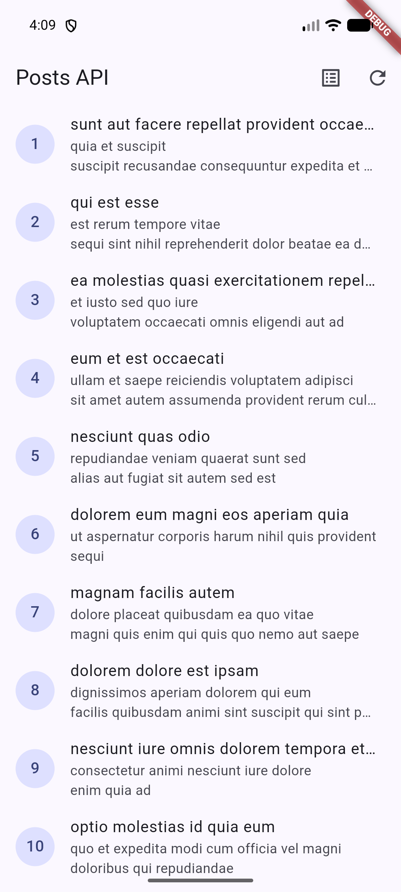
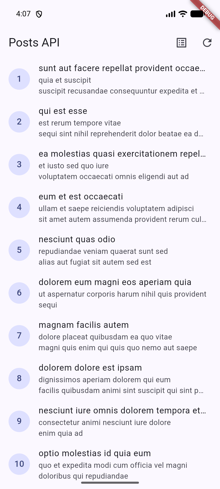
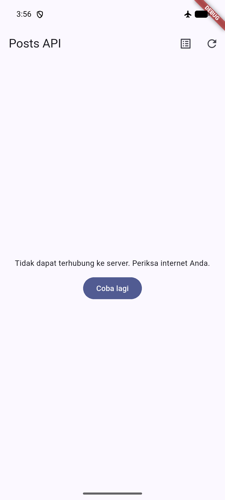
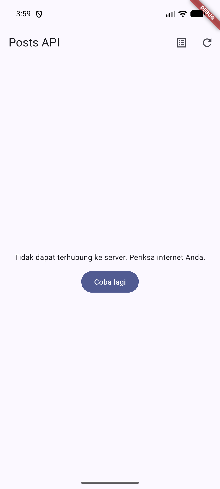
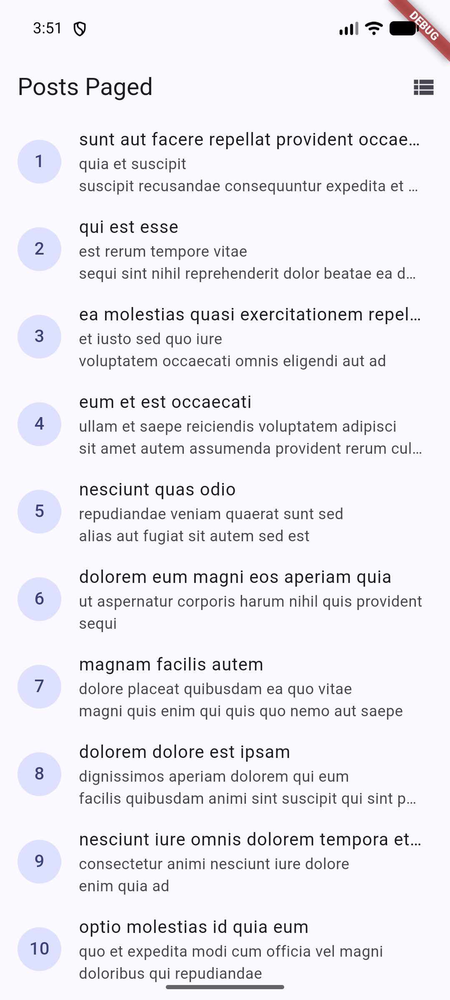
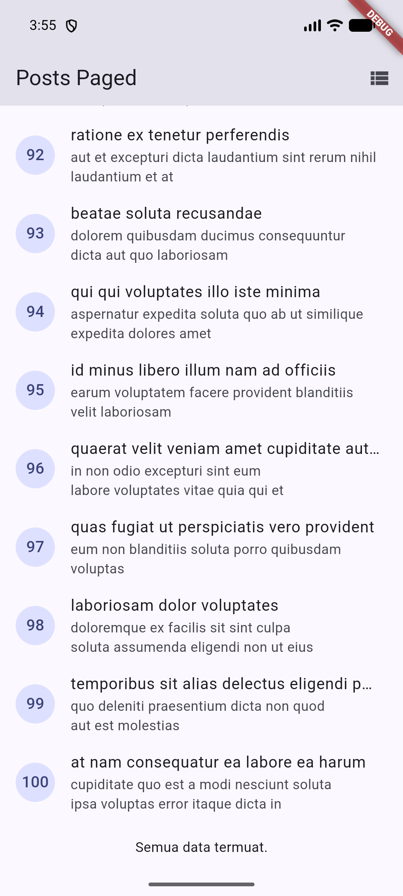

# Week 4 — Networking & REST API (Dio + Riverpod + Repository Pattern)

Laporan praktikum minggu 4 mata kuliah Mobile Programming.

Nama: Ahmad Kevin Malik
NIM: 244107020125

---

## Tujuan

- Menjelaskan konsep HTTP, REST API, dan JSON.
- Memetakan JSON ke model Dart (serialization) dengan aman null.
- Menerapkan repository pattern dasar sehingga UI tidak memanggil API secara langsung.
- Mengonfigurasi Dio (base URL, timeout, interceptor) dan menangani error jaringan.
- Menampilkan state loading, error, empty, dan success pada UI dengan AsyncValue + Riverpod.
- Menerapkan pagination dasar (infinite scroll).

## Stack Teknologi

- Flutter (Material 3)
- [dio](https://pub.dev/packages/dio) — HTTP client
- [flutter_riverpod](https://pub.dev/packages/flutter_riverpod) — state management
- [go_router](https://pub.dev/packages/go_router) — navigasi halaman detail
- flutter_test — unit & widget test
- API: [JSONPlaceholder](https://jsonplaceholder.typicode.com) (tanpa API key)

## Arsitektur

Aturan utama minggu ini: **UI tidak boleh memanggil Dio secara langsung**.

```
UI (ConsumerWidget)
   │ watch
   ▼
Provider (AsyncNotifier / Notifier)      lib/data/providers.dart, paged_posts.dart
   │ panggil
   ▼
Repository                               lib/data/repositories/post_repository.dart
   │ pakai                                      comment_repository.dart
   ▼
Dio (base URL, timeout, interceptor)     lib/data/api_client.dart
   │ HTTP
   ▼
REST API (jsonplaceholder.typicode.com)
```

Exception jaringan dibiarkan naik dari repository, lalu berubah menjadi
`AsyncError` secara otomatis lewat `AsyncNotifier`. Pesan teknis
(`DioException`) diterjemahkan menjadi pesan ramah pengguna oleh
`friendlyErrorMessage` di `lib/data/network_errors.dart`.

## Struktur Project

```
lib/
├── main.dart                       # Entry point + ProviderScope + MaterialApp.router
├── router.dart                     # GoRouter: /posts, /posts-paged, /post/:id
├── data/
│   ├── api_client.dart             # Dio terpusat: baseUrl, timeout 10s, LogInterceptor
│   ├── network_errors.dart         # friendlyErrorMessage (dipakai ulang semua halaman)
│   ├── providers.dart              # dioProvider, postRepositoryProvider, postListProvider
│   ├── paged_posts.dart            # PagedPostsState + PagedPostsNotifier (infinite scroll)
│   ├── comment_providers.dart      # AI Challenge: provider + error message /comments
│   ├── models/
│   │   ├── post.dart               # fromJson aman null
│   │   └── comment.dart            # fromJson aman null (AI Challenge)
│   └── repositories/
│       ├── post_repository.dart    # fetchPosts, fetchPostById, fetchPostsPage
│       └── comment_repository.dart # fetchComments(postId) (AI Challenge)
└── pages/
    ├── post_list_page.dart         # List penuh (100 posts) + 4 state UI
    ├── paged_post_page.dart        # Infinite scroll, 10 item/halaman
    ├── post_detail_page.dart       # Detail post (title + body lengkap)
    └── widgets/
        └── post_tile.dart          # Widget baris post (hasil refactoring)
```

---

## Langkah Pengerjaan

### Langkah 1 — Persiapan project & Praktikum 1 (Dio + model data)

Project dibuat dengan `flutter create`, lalu menambahkan dependency:

```bash
flutter pub add dio flutter_riverpod
```

Tiga file data layer dibuat pada praktikum ini:

1. **Model `Post`** (`lib/data/models/post.dart`) — `fromJson` memakai pola
   cast defensif `(json['x'] as num?)?.toInt() ?? 0` dan
   `json['x'] as String? ?? ''` sehingga field yang hilang/null tidak
   menyebabkan crash `type 'Null' is not a subtype`.
2. **`createDio()`** (`lib/data/api_client.dart`) — base URL, connect/receive
   timeout 10 detik, header `Accept`, dan `LogInterceptor` dikonfigurasi
   **terpusat** di satu tempat.
3. **`PostRepository`** (`lib/data/repositories/post_repository.dart`) —
   `fetchPosts()` mengambil `GET /posts`, memfilter
   `whereType<Map<String, dynamic>>`, dan memetakan ke `List<Post>`.
   Repository tidak menampilkan UI dan tidak menelan exception.

### Langkah 2 — Praktikum 2: Provider, error handling, dan 4 state UI

- `postListProvider` (AsyncNotifierProvider) memanggil repository di
  `build()`; exception otomatis menjadi `AsyncError`.
- `friendlyErrorMessage` memetakan tiap `DioExceptionType` menjadi pesan
  Indonesia: timeout, connection error, 404, 401/403, dan server error.
- `PostListPage` (ConsumerWidget) menangani 4 state lewat `AsyncValue.when`:

| State | Tampilan | Bukti |
|---|---|---|
| Loading | `CircularProgressIndicator` di tengah layar |  |
| Success | List 100 posts, tap baris membuka detail |  |
| Error | Pesan ramah + tombol "Coba lagi" |  |
| Empty | "Belum ada data dari server." | (diuji lewat fake repository di test) |

Tiga skenario error diuji manual:

1. **Sukses** — internet normal: loading lalu 100 posts tampil.
2. **Mode pesawat** — refresh gagal, muncul
   "Tidak dapat terhubung ke server. Periksa internet Anda." + tombol
   **Coba lagi**. Setelah internet dinyalakan, retry berhasil
   (bukti pemulihan: ).
3. **baseUrl salah** — baseUrl sementara diubah ke domain tidak valid,
   aplikasi menampilkan pesan error ramah (tidak crash), lalu baseUrl
   dikembalikan.

### Langkah 3 — Praktikum 3: Pagination (infinite scroll)

- `fetchPostsPage({page, limit})` menambahkan query
  `?_page=N&_limit=10` pada request.
- `PagedPostsNotifier` menyimpan `PagedPostsState`
  (items, page, isLoadingMore, hasMore, error). Guard
  `if (state.isLoadingMore || !state.hasMore) return;` mencegah
  request ganda.
- `PagedPostPage` memakai `ScrollController`; halaman berikutnya dimuat
  saat posisi scroll mendekati ujung (sisa 200px), ditambah **auto-load**
  post-frame untuk kasus konten halaman pertama belum memenuhi satu layar
  (perbaikan bug "mentok 10 item" — penjelasan di bagian Refleksi).

Pengujian: scroll ke bawah memuat item 11–20, 21–30, dst. tanpa reload
penuh. Di ujung data (100 item) indikator berubah menjadi teks
"Semua data termuat."




### Langkah 4 — AI Challenge: endpoint /comments

Sesuai instruksi, AI coding assistant (Gemini via Antigravity) diminta
membuat repository layer untuk `GET /comments?postId={id}`. Hasil AI
diverifikasi dengan checklist codelab, ditemukan beberapa masalah, lalu
diperbaiki. Rincian prompt, temuan verifikasi, dan perbaikan
didokumentasikan lengkap di [`docs/ai-challenge.md`](docs/ai-challenge.md).

Ringkasan verifikasi:

- UI tidak memanggil Dio langsung — aman.
- `Comment.fromJson` aman null — aman.
- Pemetaan `DioExceptionType` lengkap (timeout, connection error, 404, 500) — aman.
- **Timeout per-request di repository** melanggar prinsip konfigurasi
  terpusat → dihapus, timeout kembali diwarisi dari `api_client.dart`.
- Test bawaan `widget_test.dart` masih menguji counter app dan gagal,
  tidak dilaporkan AI → diperbaiki menjadi smoke test dengan fake
  repository (tanpa HTTP sungguhan).
- Ditambah 2 edge case test buatan sendiri: angka double dari API dan
  tipe salah total (`TypeError`).

### Langkah 5 — Refactoring (PostTile, network_errors, detail page)

1. **`PostTile`** — widget baris post diekstrak ke
   `lib/pages/widgets/post_tile.dart` sehingga kedua `ListView.builder`
   jauh lebih pendek dan mudah diuji.
2. **`friendlyErrorMessage`** — dipindah ke `lib/data/network_errors.dart`
   agar dipakai ulang halaman paged dan non-paged (di-re-export dari
   `providers.dart`).
3. **Halaman detail + GoRouter** — route `/post/:id` menampilkan title dan
   body lengkap. State detail diambil dari list yang sudah dimuat; bila
   halaman dibuka langsung (deep link), fallback `GET /posts/:id` via
   repository (`fetchPostById`). Kedua list terhubung lewat tombol di
   AppBar (mode penuh ↔ paginated).

Tap post #1 di list membuka halaman detail:


### Langkah 6 — Testing

Verifikasi otomatis (hasil terakhir):

```
flutter analyze  → 0 error/warning
                   (1 lint info package_names: nama folder tugas diawali
                    underscore, mengikuti struktur repo kursus — dibiarkan)
flutter test     → 10/10 lulus:
                   - fromJson aman null (field hilang/null)
                   - edge case: angka double, tipe salah → TypeError
                   - friendlyErrorMessage (timeout, connection error, 404, 500)
                   - provider sukses + error dengan fake repository (tanpa internet)
                   - smoke test AppBar via GoRouter (2 test, fake repository)
```

Pola fake repository (override `postRepositoryProvider`) menjadi fondasi
mock API untuk Minggu 12 (Testing & QA).

---

## Cara Menjalankan

```bash
flutter pub get
flutter run
```

> Catatan lingkungan: pada setup saya, emulator pernah mengalami DNS gagal
> (request selalu timeout padahal internet host normal). Solusinya,
> jalankan emulator dengan DNS eksplisit:
> `emulator -avd <nama_avd> -dns-server 8.8.8.8,1.1.1.1`

Perintah verifikasi:

```bash
flutter analyze
flutter test
```

## Refleksi

**Mengapa UI dilarang memanggil Dio langsung?**
Logika parsing, error handling, dan konfigurasi jaringan akan tersebar di
banyak widget: tidak bisa dites tanpa HTTP sungguhan, perubahan endpoint
harus menyentuh banyak tempat, dan tidak ada satu pintu untuk
caching/retry. Dengan repository, UI hanya membaca `AsyncValue`.

**Kapan pagination client-side cukup, dan kapan server-side?**
Client-side cukup bila data total kecil–sedang dan sekali fetch masih
nyaman. Server-side (`_page`/`_limit`, cursor) wajib bila data besar atau
berubah terus. Praktikum ini sudah server-side lewat query `_page`/`_limit`.

**Bagaimana exception repository berubah menjadi AsyncError tanpa
try/catch di tiap widget?**
`AsyncNotifier.build()` menangkap exception yang tidak tertangkap dan
menyetel state `AsyncError` otomatis. `try/catch` eksplisit tetap dibutuhkan
saat ingin memulihkan diri dalam satu operasi: menyimpan data lama saat
load halaman berikutnya gagal (`loadNextPage`), atau saat `refresh()`
perlu mengganti state manual.

**Bagian mana dari hasil AI yang diperbaiki, dan mengapa?**
(1) Timeout per-request dihapus dari repository — konfigurasi jaringan
harus terpusat; (2) menambah edge case test karena test AI hanya menutup
kasus null/field hilang; (3) memperbaiki `widget_test.dart` bawaan yang
gagal dan tidak dilaporkan AI; (4) bug fix pagination: list yang muat satu
layar tidak pernah memicu scroll listener sehingga halaman 2 tidak pernah
dimuat — ditambah auto-load post-frame. Detail: `docs/ai-challenge.md`.

## Kesimpulan

Seluruh learning outcomes tercapai: aplikasi mengambil data REST API
melalui repository pattern dengan Dio terpusat, model tahan data rusak,
empat state UI ditangani, pagination berjalan dengan guard request ganda,
ditambah halaman detail GoRouter, dokumentasi verifikasi AI, dan test
otomatis yang seluruhnya lulus.
