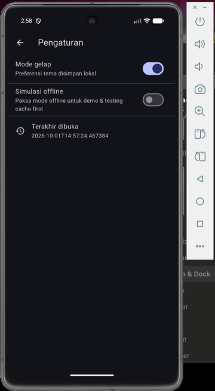
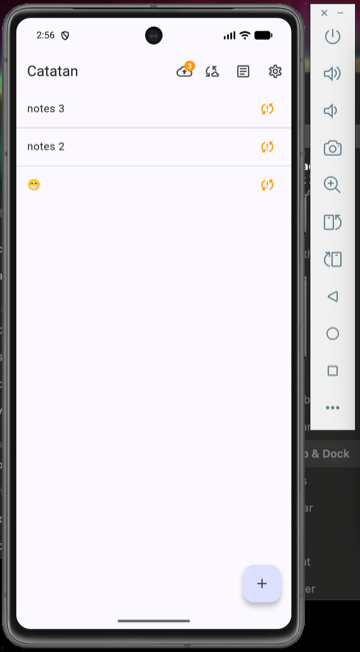
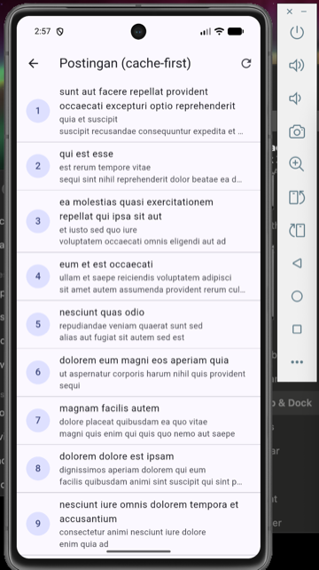
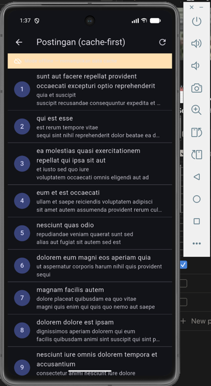
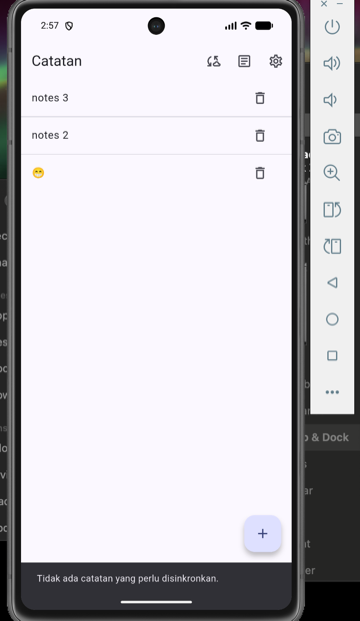
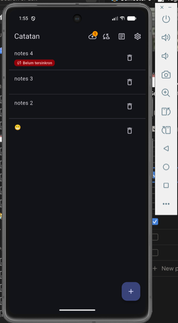

# Week 5 — Local Storage & Offline-First (SharedPreferences + SQLite + Riverpod)

Laporan praktikum minggu 5 mata kuliah Mobile Programming.

Nama: Ahmad Kevin Malik
NIM: 244107020125

---

## Tujuan

- Menjelaskan perbedaan penyimpanan key-value, relasional, dan NoSQL di perangkat.
- Menyimpan preferensi sederhana (tema, terakhir dibuka) dengan SharedPreferences.
- Menerapkan CRUD catatan dengan SQLite (sqflite) melalui repository lokal.
- Menerapkan pola offline-first: cache-first read, dirty flag, dan antrean sinkronisasi.
- Menampilkan state loading, error, empty, dan success untuk data lokal dengan Riverpod.
- Menguji repository lokal dengan repository palsu (tanpa database sungguhan).

## Stack Teknologi

- Flutter (Material 3)
- [shared_preferences](https://pub.dev/packages/shared_preferences) — preferensi key-value
- [sqflite](https://pub.dev/packages/sqflite) — database SQLite lokal
- [path](https://pub.dev/packages/path) — menyusun path database
- [flutter_riverpod](https://pub.dev/packages/flutter_riverpod) — state management
- [go_router](https://pub.dev/packages/go_router) — navigasi deklaratif
- [dio](https://pub.dev/packages/dio) — HTTP client (untuk cache-first `/posts`)
- flutter_test — unit & provider test
- API: [JSONPlaceholder](https://jsonplaceholder.typicode.com) (tanpa API key)

## Arsitektur Offline-First

Aturan utama minggu ini: **UI tidak boleh memanggil SQLite/SharedPreferences
secara langsung**. Semua lewat repository + provider.

```
UI (ConsumerWidget)
   │ watch
   ▼
Provider (AsyncValue: loading/error/data)        lib/data/providers.dart
   │ panggil
   ▼
Repository lokal / SyncService                   lib/data/repositories/*.dart
   │ CRUD / cache                                    lib/data/sync.dart
   ▼
SQLite (sqflite) + SharedPreferences             lib/data/local/db.dart, prefs.dart
   │
   ▼
Remote (simulasi sync)  ── sukses ──►  dirty = 0
```

Tiga mekanisme offline-first yang diterapkan:

1. **Cache-first read** — `PostsNotifier.build()` membaca `cached_posts`
   terlebih dahulu (UI tidak blank saat offline), lalu refresh dari jaringan
   di background dan menyimpan hasilnya untuk kunjungan berikutnya.
2. **Dirty flag** — setiap catatan baru diubah lokal ditandai `dirty = 1`
   pada kolom `notes.dirty`.
3. **Antrean sinkronisasi** — `SyncService.syncNotes()` menghitung catatan
   dirty, mensimulasikan upload, lalu memanggil `markAllSynced()`.
   **Aturan konflik: last-write-wins berdasarkan `updated_at`.**

## Struktur Project

```
lib/
├── main.dart                       # Entry point + ProviderScope + MaterialApp.router
├── router.dart                     # GoRouter: /notes, /note/:id, /posts, /settings
├── data/
│   ├── api_client.dart             # createDio(): baseUrl, timeout, LogInterceptor
│   ├── prefs.dart                  # PrefsRepository (SharedPreferences)
│   ├── providers.dart              # semua provider (prefs, note, sync, posts, dirty)
│   ├── sync.dart                   # SyncService: cache posts + syncNotes
│   ├── local/
│   │   ├── note.dart               # model Note (+ dirty, toMap/fromMap aman null)
│   │   └── db.dart                 # openNotesDb(): tabel notes & cached_posts
│   ├── models/
│   │   └── post.dart               # model Post (dipakai cache-first)
│   └── repositories/
│       ├── note_repository.dart    # CRUD catatan + countDirty + markAllSynced
│       └── post_repository.dart    # fetchPosts() dari Dio
└── pages/
    ├── notes_page.dart             # daftar catatan + badge dirty + sync
    ├── note_detail_page.dart       # detail catatan (baca repository lokal)
    ├── posts_page.dart             # cache-first + banner offline
    ├── settings_page.dart          # toggle tema + simulasi offline
    └── widgets/
        └── note_tile.dart          # NoteTile + badge "Belum tersinkron"
```

---

## Langkah Pengerjaan

### Langkah 1 — Praktikum 1: SharedPreferences (preferensi)

Menambahkan dependency:

```bash
flutter pub add flutter_riverpod shared_preferences sqflite path dio go_router
```

Seluruh akses key-value dipusatkan di **`PrefsRepository`**
(`lib/data/prefs.dart`), bukan tersebar di widget:

- `getDarkMode()` / `setDarkMode(bool)` — menyimpan preferensi tema.
- `markOpenedNow()` / `getLastOpened()` — mencatat waktu terakhir dibuka
  (`markOpenedNow()` dipanggil di `main()` saat aplikasi start).

`darkModeProvider` (AsyncNotifier) membaca preferensi di `build()` dan
menyimpan lewat `toggle()`. Halaman **Pengaturan** menampilkan toggle mode
gelap, toggle simulasi offline, dan waktu terakhir dibuka.



### Langkah 2 — Praktikum 2: SQLite + repository catatan

**Model `Note`** (`lib/data/local/note.dart`) memuat field `dirty` untuk
menandai catatan yang belum tersinkron, dengan `fromMap` aman terhadap field
yang hilang (memakai cast defensif dan default).

**`openNotesDb()`** (`lib/data/local/db.dart`) membuka satu database
`offline_notes.db` dengan dua tabel: `notes` (id, title, body, updated_at,
dirty) dan `cached_posts` (id, payload, cached_at).

**`NoteRepository`** adalah satu-satunya pintu ke tabel `notes`:
`fetchNotes()` (urut `updated_at DESC`), `addNote()`, `deleteNote()`,
`countDirty()`, dan `markAllSynced()`. Constructor menerima `openDb` opsional
agar test dapat menyuntikkan database palsu tanpa menyentuh SQLite sungguhan.

Halaman **Catatan** menampilkan daftar + **badge jumlah catatan belum
tersinkron** di AppBar. Setiap baris yang dirty menampilkan badge
"Belum tersinkron". Setelah menambah 4 catatan, badge dirty bernilai 3
(satu catatan sudah tersinkron):



### Langkah 3 — Praktikum 3: Cache-first & antrean sync

**Cache-first untuk data API** — `PostsNotifier.build()` mengembalikan isi
`cached_posts` seketika, lalu memanggil refresh di background (Dio `GET /posts`
→ `cachePosts()`). Bila jaringan gagal, cache yang sudah tampil dipertahankan.
Halaman **Postingan** saat online:



**Simulasi offline deterministik** — selain mode pesawat sungguhan, tersedia
toggle `forceOffline` pada halaman Pengaturan agar demo/testing tidak
bergantung pada kondisi Wi-Fi. Saat aktif, halaman Postingan menampilkan
banner oranye **"Mode offline — menampilkan data cache"** sambil tetap
menampilkan daftar post dari cache:



**Sinkronisasi catatan dirty** — `SyncService.syncNotes()` menghitung
`countDirty()`, mensimulasikan upload (delay 1 detik), lalu `markAllSynced()`.
Aturan konflik yang dipilih dan didokumentasikan: **last-write-wins
berdasarkan `updated_at`**.

Setelah menekan tombol sync, badge dirty kembali menjadi 0 dan seluruh baris
kehilangan badge "Belum tersinkron":



### Langkah 4 — Refactoring Challenge

1. **`NoteTile`** diekstrak ke `lib/pages/widgets/note_tile.dart` — baris
   catatan menampilkan badge "Belum tersinkron" bila `dirty == true`,
   lengkap dengan aksi tap ke detail dan tombol hapus.
2. **Logika cache & sync dipindah** ke `lib/data/sync.dart` (`SyncService`),
   sehingga `NoteRepository` dan `PostRepository` tetap fokus pada CRUD.
3. **Halaman detail catatan** dengan GoRouter `/note/:id`
   (`lib/pages/note_detail_page.dart`) yang membaca dari repository lokal
   lewat `noteByIdProvider` (family), **bukan** dari state halaman list.



---

## Pengujian

### Verifikasi manual (offline-first)

| Skenario | Hasil | Bukti |
|---|---|---|
| Tambah catatan offline | Catatan tersimpan, badge dirty bertambah |  |
| Sync catatan dirty | Badge kembali 0, baris bebas badge |  |
| Buka Postingan online | Daftar tampil, cache terisi |  |
| Buka Postingan offline | Banner offline + data cache tetap tampil |  |
| Preferensi tema & waktu buka | Tersimpan lokal, bertahan setelah restart |  |

### Verifikasi statis

```bash
flutter analyze
```

Hasil: **0 error/warning** — hanya 1 lint info `package_names` (nama folder
tugas diawali underscore mengikuti struktur repo kursus) yang dibiarkan.

### Unit & provider test

> **Status: menyusul.** Rencana test pada `test/note_test.dart`:
> (1) unit test mapping `Note.fromMap` aman null, (2) flag `dirty` bertahan
> saat serialisasi, (3) provider sukses dengan `FakeNoteRepository`,
> (4) provider error dengan repository palsu. Pola `FakeNoteRepository`
> (override `openDb`) menjadi fondasi mock database untuk Minggu 12.

---

## AI Challenge

> **Status: menyusul** — prompt, output awal AI, tabel perbandingan storage
> (SharedPreferences / Hive / sqflite / Drift), hasil verifikasi, dan
> keputusan final akan didokumentasikan di `docs/ai-challenge.md`.

---

## Cara Menjalankan

```bash
flutter pub get
flutter run
```

> Catatan: `shared_preferences` dan `sqflite` adalah plugin native. Setelah
> menambah/mengubah plugin, lakukan **full restart** (`flutter run` ulang),
> bukan sekadar hot reload, agar tidak muncul `MissingPluginException`.

Perintah verifikasi:

```bash
flutter analyze
flutter test
```

## Refleksi

**Mengapa daftar catatan tidak boleh disimpan di SharedPreferences?**
SharedPreferences hanya untuk nilai primitif kecil. Menyimpan koleksi catatan
sebagai satu string JSON membuat query (urut, filter, hitung dirty), update
parsial, dan sinkronisasi menjadi rapuh dan lambat — setiap perubahan harus
menulis ulang seluruh string. Data koleksi selalu masuk database (SQLite).

**Kapan cache-first cukup, dan kapan butuh strategi lain?**
Cache-first cocok untuk data bacaan yang jarang berubah (daftar post, katalog).
Untuk data yang berubah cepat dan menuntut akurasi (harga real-time, stok),
network-first lebih tepat agar pengguna tidak melihat data basi.

**Bagaimana dirty flag menjadi antrean sync tanpa memblokir UI?**
Perubahan lokal langsung tersimpan dan menandai `dirty = 1`; UI tidak
menunggu server. Saat sync dijalankan, catatan dirty dikirim di background
lalu ditandai bersih. Bila antrean perlu urutan/retry yang rumit, tabel
outbox terpisah menjadi perlu.

## Kesimpulan

Kombinasi **SharedPreferences + SQLite (sqflite)** sesuai kebutuhan aplikasi
ini: preferensi kecil (tema, waktu buka) disimpan key-value, sedangkan koleksi
catatan yang butuh query, pengurutan, dan penanda sinkronisasi disimpan
relasional. Pola offline-first (cache-first read, dirty flag, antrean sync)
membuat aplikasi tetap berfungsi penuh saat offline, dengan seluruh akses data
melewati repository + Riverpod sehingga mudah diuji.
