# Week 6 — Authentication, Security & FCM (Flutter)

Laporan praktikum minggu 6 mata kuliah Mobile Programming.

Nama: Ahmad Kevin Malik
NIM: 244107020125

---

## Tujuan

- Menyimpan token autentikasi dengan aman di penyimpanan terenkripsi perangkat,
  bukan di SharedPreferences biasa.
- Menerapkan alur login + refresh token otomatis saat backend membalas `401`.
- Melindungi halaman dengan guard rute sehingga halaman privat tidak bisa
  dibuka tanpa sesi yang sah.
- Mengintegrasikan Firebase Cloud Messaging (FCM) untuk menerima notifikasi
  pengumuman kampus.
- Menangani notifikasi di tiga kondisi aplikasi: foreground, background, dan
  terminated, termasuk deep link ke halaman pengumuman.
- Menguji logika rute dan pemetaan error dengan unit test murni.

## Fitur Utama

- **Login dengan guard rute** — halaman privat selalu diarahkan ke `/login`
  bila belum ada sesi.
- **Penyimpanan token aman** — access & refresh token di `flutter_secure_storage`
  (Keychain/Keystore), bukan SharedPreferences.
- **Refresh token otomatis** — Dio menyisipkan access token dan, saat `401`,
  refresh sekali lalu mengulang request; bila refresh mati, sesi dibersihkan
  dan pengguna diarahkan login ulang.
- **FCM terintegrasi** — permission, `getToken` + `onTokenRefresh`, dan
  subscribe topik `pengumuman-kampus`.
- **Notifikasi 3 state** — foreground (banner manual), background, dan
  terminated, semuanya dapat membuka deep link ke `/pengumuman/:id`.
- **Unit test** — 19 test untuk parsing route, logika sesi/refresh, dan
  pemetaan error.

## Stack Teknologi

- Flutter (Material 3)
- [flutter_riverpod](https://pub.dev/packages/flutter_riverpod) — state management
- [go_router](https://pub.dev/packages/go_router) — navigasi deklaratif + guard
- [dio](https://pub.dev/packages/dio) — HTTP client + interceptor refresh token
- [flutter_secure_storage](https://pub.dev/packages/flutter_secure_storage) — penyimpanan token terenkripsi
- [firebase_core](https://pub.dev/packages/firebase_core) + [firebase_messaging](https://pub.dev/packages/firebase_messaging) — FCM
- [flutter_local_notifications](https://pub.dev/packages/flutter_local_notifications) — banner notifikasi saat foreground
- flutter_test — unit test

## Arsitektur

### Alur autentikasi & keamanan token

```
UI (LoginPage)
   │ login(email, password)
   ▼
AuthNotifier (Riverpod)                    lib/providers/auth_provider.dart
   │ AuthRepository.login()                lib/data/auth_repository.dart
   ▼
TokenStore.save(access, refresh)           lib/data/token_store.dart
   │  → FlutterSecureStorage (Keychain/Keystore)
   ▼
AuthNotifier build() membaca access token  → authStateProvider (bool)
   │
   ▼
GoRouter redirect: belum login → /login    lib/router.dart
```

Token **tidak pernah** disimpan di SharedPreferences. `TokenStore` adalah
satu-satunya pintu masuk/keluar token, memakai `FlutterSecureStorage` yang
dienkripsi di level OS (Keychain iOS, Keystore Android).

### Refresh token otomatis (401)

`buildApiClient()` (`lib/data/api_client.dart`) memasang interceptor Dio:

1. **onRequest** — menyisipkan `Authorization: Bearer <access>`.
2. **onError** — saat balasan `401`:
   - jika request ini **sudah** pernah di-retry (ditandai `extra`), token
     dianggap mati → `store.clear()` + `onSessionExpired()` dan error
     diteruskan;
   - jika refresh token tidak ada, langsung `onSessionExpired()`;
   - jika belum, refresh token ditukar lewat `AuthRepository.refresh()`,
     token baru disimpan, lalu request asli diulang **sekali**.

Penanda `_retriedAfterRefresh` mencegah loop refresh tanpa henti bila server
terus membalas `401`. Callback `onSessionExpired` dipakai provider untuk
memanggil `logout()` sehingga guard langsung mengarahkan pengguna ke `/login`
tanpa menunggu restart aplikasi.

### Guard rute

`routerProvider` memakai `redirect` yang membaca `authStateProvider`:

- `auth.isLoading` → `null` (tunggu pembacaan token selesai);
- belum login & bukan di `/login` → pindah ke `/login`;
- sudah login & berada di `/login` → pindah ke `/`.

`refreshListenable` berupa `ValueNotifier<int>` yang **selalu naik** setiap
status auth berubah. Nilai boolean tidak berubah saat `false → false`, jadi
counter dipakai agar GoRouter tetap menjalankan ulang redirect.

### FCM & deep link

```
main()
 ├─ registerBackgroundHandler()        ← wajib sebelum runApp
 ├─ runApp(...)
 └─ addPostFrameCallback
      ├─ attachRouter(router.go)       ← router siap, deep link bisa jalan
      ├─ listenOpened()                ← background → diketuk
      └─ handleTerminated()            ← terminated → getInitialMessage()
```

Handler di `lib/messaging/push_service.dart` **tidak tahu** soal GoRouter.
Mereka hanya memanggil `go(route)` yang disuntikkan lewat `attachRouter`.
Route diambil dari `routeFromMessage(message.data)` (`lib/routes.dart`), jadi
handler tidak menyentuh `Map` secara langsung dan logikanya bisa diuji.

Tiga kondisi notifikasi:

| Kondisi | Handler | Perilaku |
|---|---|---|
| Foreground | `FirebaseMessaging.onMessage` | banner dibuat manual lewat `flutter_local_notifications` |
| Background | `onMessageOpenedApp` | banner dari sistem, klik → `router.go` |
| Terminated | `getInitialMessage()` | app cold start, langsung ke route notifikasi |

**Pengiriman token ke backend.** Backend belum tersedia, jadi kontraknya
didokumentasikan: `POST /devices` dengan body
`{ "fcm_token": "<token>", "platform": "android" }`. Titik integrasinya ada di
`main.dart` pada callback `onToken` milik `initFcmToken()` — token awal dari
`getToken()` maupun token baru dari `onTokenRefresh` melewati jalur yang sama.

## Struktur Project

```
lib/
├── main.dart                       # init Firebase, background handler, wiring push
├── router.dart                     # GoRouter + guard auth
├── routes.dart                     # konstanta rute + routeFromMessage()
├── data/
│   ├── announcements.dart          # data mock pengumuman
│   ├── api_client.dart             # Dio + interceptor refresh 401
│   ├── api_errors.dart             # messageForError(): error → pesan ramah
│   ├── auth_repository.dart        # AuthRepository mock (kontrak token)
│   └── token_store.dart            # FlutterSecureStorage (Keychain/Keystore)
├── messaging/
│   └── push_service.dart           # handler FCM 3 kondisi + topik
├── pages/
│   ├── login_page.dart             # form login
│   ├── home_page.dart              # daftar pengumuman + kartu Debug FCM
│   └── announcement_page.dart      # detail pengumuman berdasarkan id
└── providers/
    ├── auth_provider.dart          # tokenStore, authRepository, apiClient, authState
    └── push_provider.dart          # fcmTokenProvider

test/
├── deep_link_test.dart             # unit test routeFromMessage + AppRoute
├── auth_test.dart                  # unit test AuthRepository + messageForError
└── refresh_test.dart               # unit test interceptor refresh 401 + sesi mati

docs/
├── ai-challenge.md                 # prompt, output awal AI, perbaikan, checklist
└── testing.md                      # tabel hasil uji tiga app state
```

---

## Langkah Pengerjaan

### Langkah 1 — Praktikum 1: Login, secure storage, refresh token, guard

**Halaman login** memvalidasi kredensial lewat `AuthRepository` mock
(`mahasiswa@kampus.ac.id` / `rahasia123`). Pesan gagal ditampilkan lewat
SnackBar:

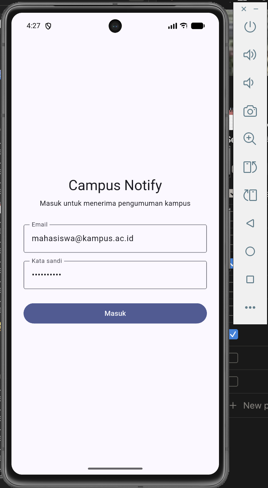
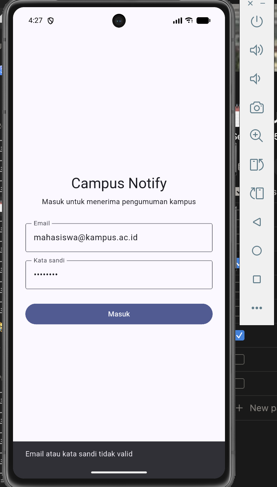

**Token disimpan aman.** Setelah login, `TokenStore.save()` menulis access &
refresh token ke `FlutterSecureStorage`. Karena `authStateProvider`
menurunkan status login dari ada/tidaknya access token, sesi bertahan setelah
app ditutup dan dibuka lagi.

**Guard rute.** Membuka `/pengumuman/1` tanpa login akan dibelokkan ke
`/login`. Setelah login, halaman daftar pengumuman tampil:

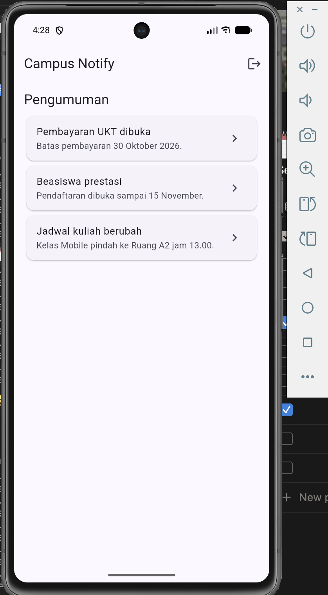

**Halaman detail** membaca konten dari satu sumber data berdasarkan `id`, jadi
daftar dan deep link FCM menunjuk ke konten yang sama:

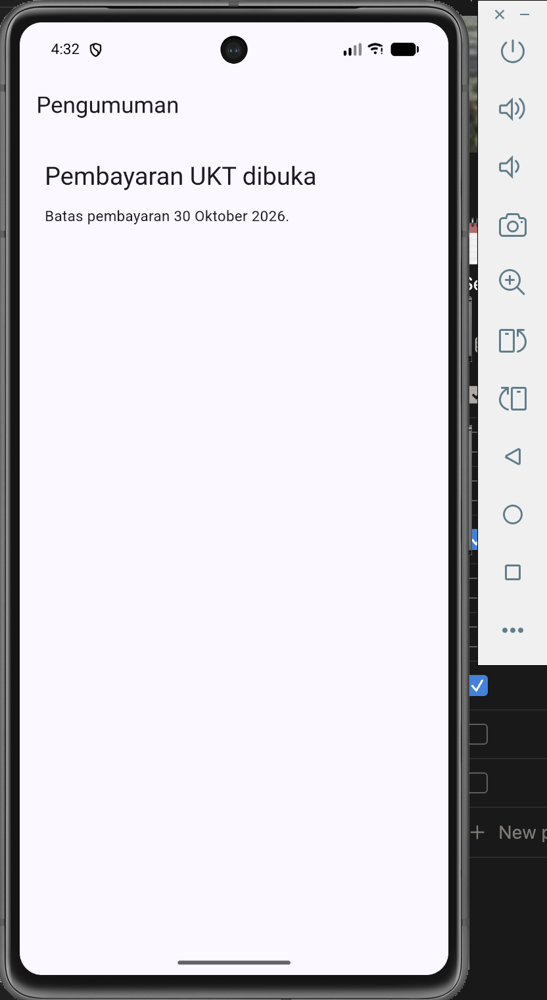
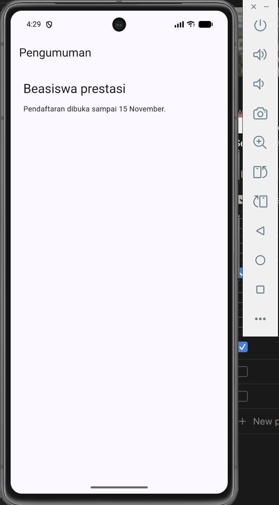
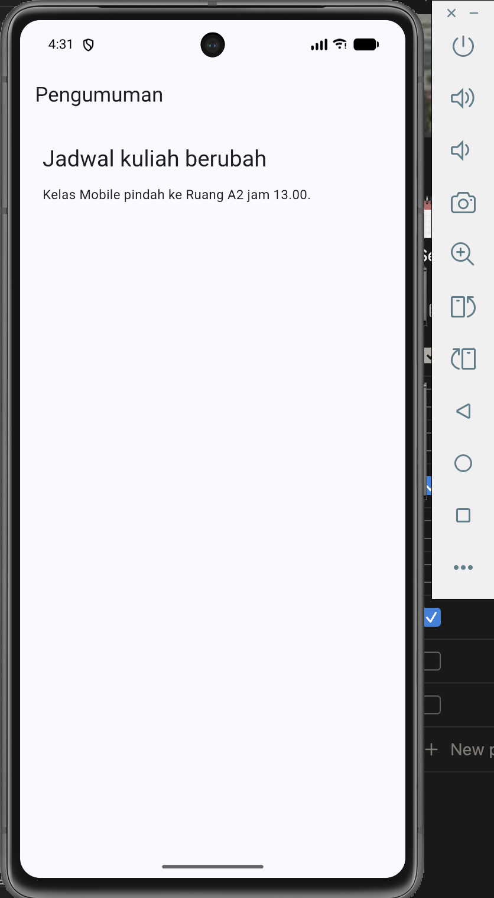

### Langkah 2 — Praktikum 2: Firebase & FCM setup

- Project Firebase **"Campus Notify"** (project id `campus-notify-3bc1d`).
- `google-services.json` diletakkan di `android/app/`.
- Plugin Gradle `com.google.gms.google-services` **4.5.0** ditambahkan di
  `android/settings.gradle.kts` (apply false) dan `android/app/build.gradle.kts`.
- Izin `POST_NOTIFICATIONS` ditambahkan di `AndroidManifest.xml`.
- Core library desugaring diaktifkan (dibutuhkan `flutter_local_notifications`).

**Izin notifikasi** diminta saat pertama kali app berjalan:

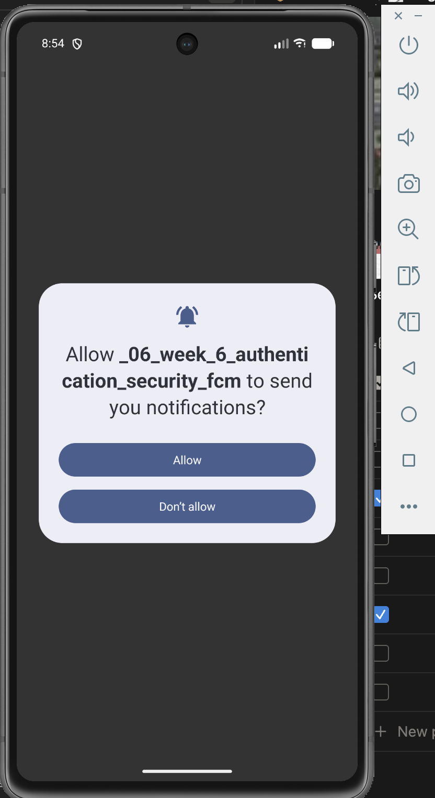

**Token lifecycle.** `initFcmToken()` mengambil token awal lewat `getToken()`
(dengan timeout 10 detik agar tidak memblokir startup), lalu memantau
perubahan lewat `onTokenRefresh`. Kartu Debug FCM menampilkan token
**terpotong** (12 karakter) untuk bukti lifecycle tanpa membocorkan token utuh:

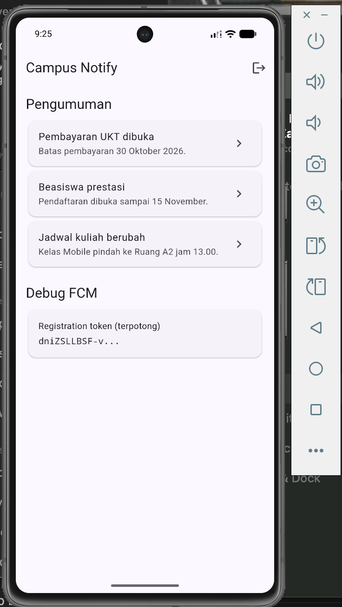
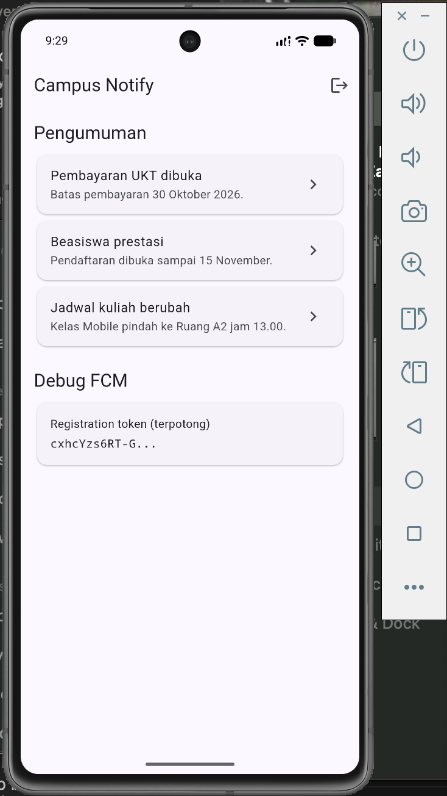

Kedua screenshot menampilkan token yang **berbeda** (`dn1ZSLLBSF-v...` vs
`cxhcYzs6RT-G...`), membuktikan `onTokenRefresh` bekerja.

**Notifikasi diterima** di emulator:

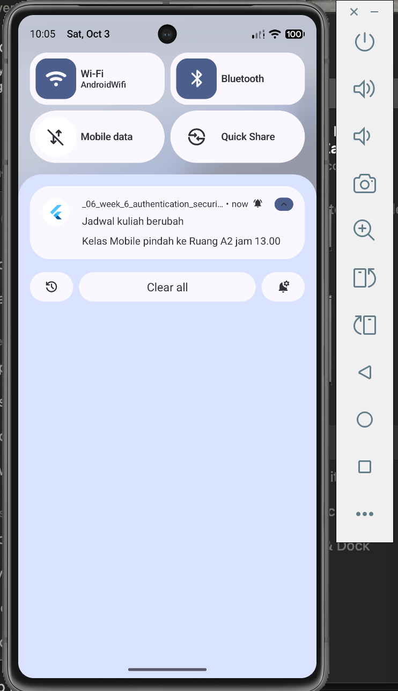

### Langkah 3 — Praktikum 3: Handler 3 kondisi + deep link

**Background handler** wajib top-level dan memakai `@pragma('vm:entry-point')`
karena berjalan di isolate terpisah:

```dart
@pragma('vm:entry-point')
Future<void> firebaseMessagingBackgroundHandler(RemoteMessage message) async {}
```

Handler ini didaftarkan **sebelum** `runApp()` supaya pesan saat app tidak
aktif tetap tertangani.

**Deep link.** Payload notifikasi berisi custom data `route` (atau `id`), yang
diterjemahkan `routeFromMessage()` menjadi path. Klik notifikasi memanggil
`router.go(path)` sehingga pengguna langsung dibawa ke halaman pengumuman.

**Topik.** Perangkat otomatis subscribe ke `pengumuman-kampus` saat init, dan
tersedia `subscribeTopic()` / `unsubscribeTopic()` untuk kontrol manual.

---

## Pengujian

### Verifikasi manual — matriks 3 kondisi FCM

Tabel lengkap beserta catatan teknis ada di [docs/testing.md](docs/testing.md).

Payload uji: title `Jadwal kuliah berubah`, body
`Kelas Mobile pindah ke Ruang A2 jam 13.00`, custom data
`route=/pengumuman/3`.

| Kondisi | Kondisi app | Yang diharapkan | Hasil | Bukti |
|---|---|---|---|---|
| Foreground | App terbuka | Banner lokal muncul | ✅ | 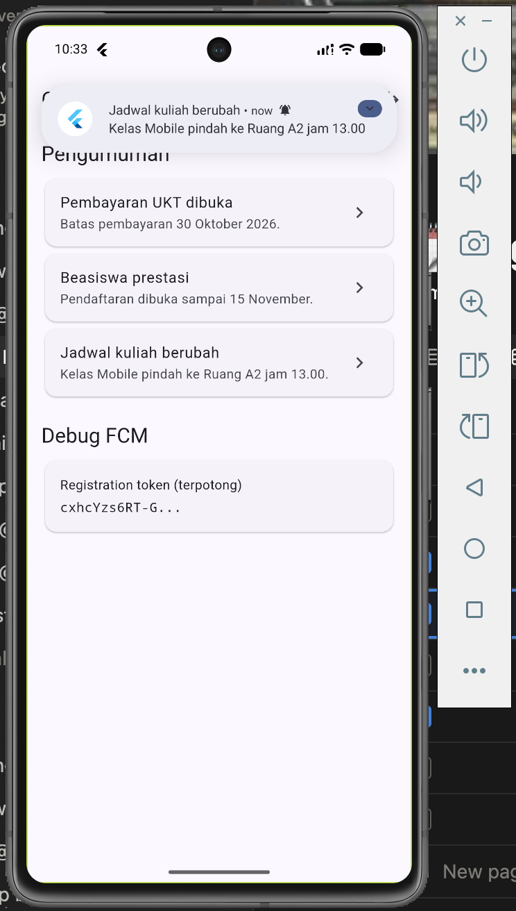 |
| Foreground | Setelah diketuk | Pindah ke `/pengumuman/3` | ✅ | 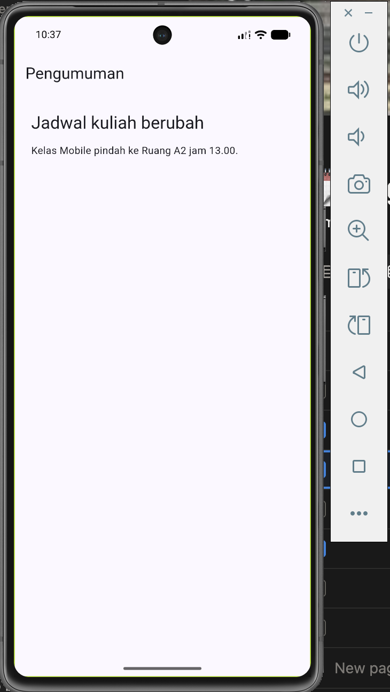 |
| Background | Ditekan Home | Banner sistem muncul | ✅ | 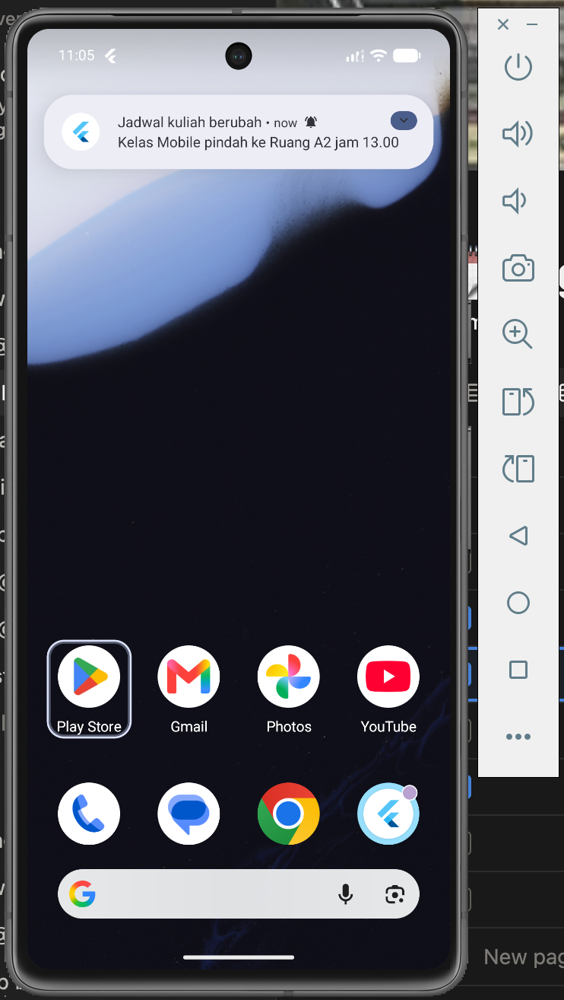 |
| Background | Setelah diketuk | Pindah ke `/pengumuman/3` | ✅ | 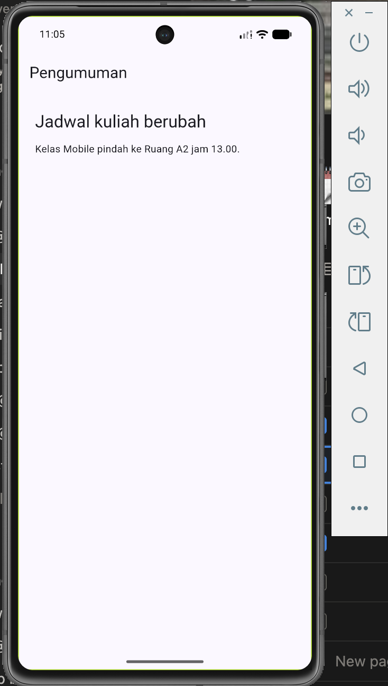 |
| Terminated | App dimatikan | Banner muncul | ✅ | 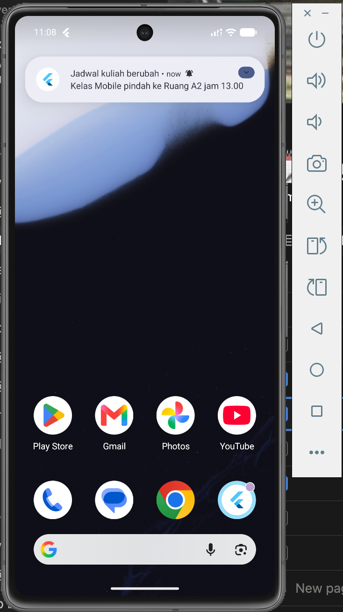 |
| Terminated | Setelah diketuk | Cold start langsung ke `/pengumuman/3` | ✅ | 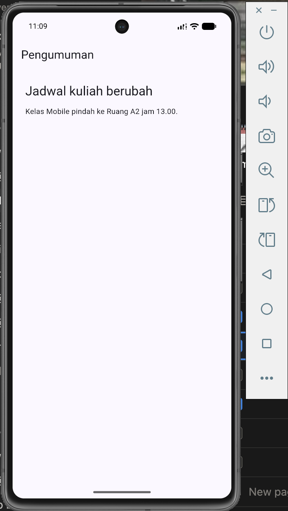 |

Campaign dikirim dari Firebase Console (Messaging):

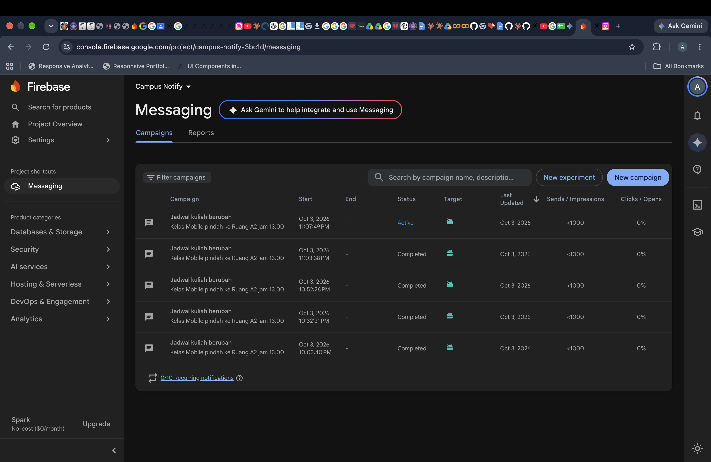

**Catatan penting:** pada background & terminated, banner ditampilkan oleh
sistem Android memakai channel notifikasi. Supaya muncul **heads-up banner**
(bukan hanya suara + ikon), app merujuk channel `pengumuman` ber-importance
tinggi lewat meta-data `com.google.firebase.messaging.default_notification_channel_id`
di `AndroidManifest.xml`, dan channel tersebut dibuat eksplisit saat init.

### Verifikasi statis

```bash
flutter analyze
```

Hasil: **0 error/warning** — hanya 1 lint info `package_names` (nama folder
tugas diawali underscore mengikuti struktur repo kursus) yang dibiarkan.

### Unit test

```bash
flutter test
```

Hasil: **19 test lolos**.

| File | Cakupan |
|---|---|
| `test/deep_link_test.dart` | `routeFromMessage()` (route eksplisit, fallback `id`, data kosong, route tidak valid) dan `AppRoute.announcementOf()` |
| `test/auth_test.dart` | `AuthRepository` (login sukses/gagal, refresh sukses/gagal) dan `messageForError()` (401, 404, 5xx, timeout, connection error, Exception biasa) |
| `test/refresh_test.dart` | interceptor Dio: refresh sekali lalu ulang request, refresh mati memanggil `onSessionExpired` + bersihkan sesi, dan `401` berulang tidak loop |

---

## AI Challenge

Prompt, output awal AI, koreksi manual, dan keputusan akhir didokumentasikan di
[docs/ai-challenge.md](docs/ai-challenge.md).

## Cara Menjalankan

```bash
flutter pub get
flutter run
```

> Catatan: setelah mengubah plugin native atau `AndroidManifest.xml`, lakukan
> **full restart** (`flutter run` ulang), bukan hot reload.

Kredensial login mock:

- Email: `mahasiswa@kampus.ac.id`
- Kata sandi: `rahasia123`

Perintah verifikasi:

```bash
flutter analyze
flutter test
```

## Refleksi

**1. Mengapa refresh token tidak boleh disimpan di SharedPreferences? Apa risikonya bila bocor?**

SharedPreferences menyimpan data sebagai teks polos di file preferensi aplikasi
(`shared_prefs/*.xml`). Siapa pun yang bisa membaca file itu — lewat backup,
perangkat yang di-root, atau kerentanan lain — langsung memperoleh refresh
token. Refresh token berumur panjang dan bisa menukar access token baru
berulang kali, jadi kebocorannya setara menyerahkan sesi login sepenuhnya:
penyerang bisa terus membuat access token baru meski access token lama sudah
kedaluwarsa, tanpa perlu tahu kata sandi pengguna. `FlutterSecureStorage`
menyimpannya di Keychain (iOS) / Keystore (Android) yang dienkripsi OS,
sehingga kebocoran file preferensi biasa tidak otomatis membocorkan sesi.

**2. Apa yang rusak bila onTokenRefresh diabaikan selama satu semester perkuliahan?**

Token FCM berubah tanpa pemberitahuan: saat aplikasi di-install ulang, data
dibersihkan, perangkat dipulihkan dari backup, atau Firebase memutar token
karena alasan keamanan. Tanpa `onTokenRefresh`, backend terus menyimpan token
lama dan mengirim notifikasi ke alamat yang sudah mati. Gejalanya berbahaya
karena **gagal secara senyap**: pengiriman dari console tampak "sukses", tetapi
tidak ada satu pun mahasiswa yang menerima pengumuman. Setelah satu semester,
praktis seluruh perangkat sudah punya token baru sementara backend masih
memegang token basi — notifikasi berhenti total tanpa satu pun error yang
terlihat.

**3. Kapan memakai topik dan kapan memakai token perangkat? Beri contoh pesan kampus untuk masing-masing.**

- **Topik** dipakai untuk siaran massal ke kelompok yang besar dan dinamis,
  ketika tidak praktis menyimpan daftar token satu per satu.
  Contoh pesan kampus: *"Pemeliharaan sistem akademik Sabtu 02.00–04.00"* yang
  dikirim ke topik `pengumuman-kampus` untuk **semua** mahasiswa.
- **Token perangkat** dipakai untuk pesan yang ditargetkan ke satu orang atau
  satu perangkat, yang isinya personal dan tidak boleh dilihat orang lain.
  Contoh pesan kampus: *"Nilai Kuis 2 Anda sudah keluar, silakan cek SIAKAD"*
  yang hanya dikirim ke token milik mahasiswa bersangkutan.

Aturan praktisnya: **topik untuk "satu pesan ke banyak orang"**, **token untuk
"pesan spesifik ke satu orang"**.

**4. Bagian mana dari draf AI yang Anda tolak atau perbaiki, dan mengapa?**

Tujuh perbaikan didokumentasikan di [docs/ai-challenge.md](docs/ai-challenge.md).
Yang paling menentukan:

- **Notifikasi background hanya berbunyi tanpa banner.** Draf tidak menyentuh
  notification channel. Sistem Android memakai channel default ber-importance
  rendah, jadi tidak ada heads-up banner. Diperbaiki dengan meta-data
  `default_notification_channel_id` dan channel `pengumuman` importance tinggi
  yang dibuat eksplisit. Ini hanya ketahuan lewat pengujian manual di device.
- **`refreshListenable` berupa boolean.** Saat status auth berubah
  `false → false`, notifier tidak mengirim sinyal sehingga guard tidak
  dijalankan ulang. Diganti `ValueNotifier<int>` yang selalu naik.
- **`getToken()` tanpa timeout** berisiko menahan startup. Dibatasi 10 detik.
- **API `flutter_local_notifications` v22 memakai named argument**, bukan
  positional seperti draf — draf tidak bisa dikompilasi.
- **Sesi tidak langsung logout saat refresh mati.** Draf hanya memanggil
  `store.clear()` tanpa memberi tahu state auth. Ditambah callback
  `onSessionExpired` → `logout()` agar guard segera mengarahkan ke `/login`.

## Kesimpulan

Autentikasi pada aplikasi ini dibangun di atas tiga pilar: **penyimpanan token
yang aman** (`FlutterSecureStorage`), **refresh otomatis sekali coba** pada
`401`, dan **guard rute** yang menjaga halaman privat. Sesi bertahan lintas
restart tanpa menaruh kredensial di tempat yang bisa dibaca bebas.

Integrasi FCM melengkapi aplikasi dengan notifikasi pengumuman yang tertangani
di ketiga kondisi (foreground, background, terminated) dan mampu membawa
pengguna langsung ke konten yang relevan lewat deep link. Pemisahan antara
`push_service` (tanpa UI) dan `router` membuat alur ini dapat diuji, dan
pemetaan error yang terpusat di `api_errors.dart` menjaga pesan ke pengguna
tetap ramah sekaligus konsisten.
