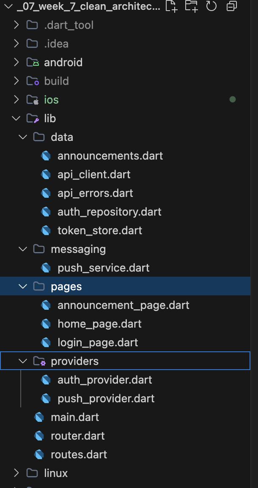
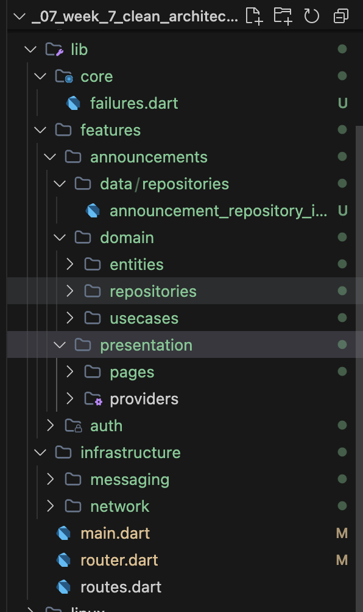
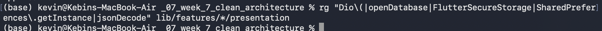
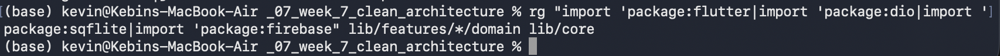
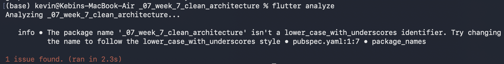
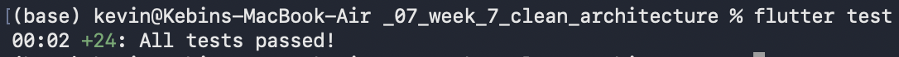
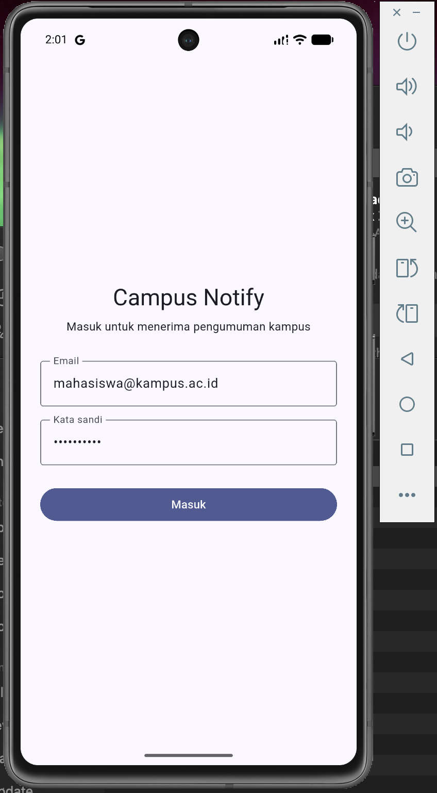
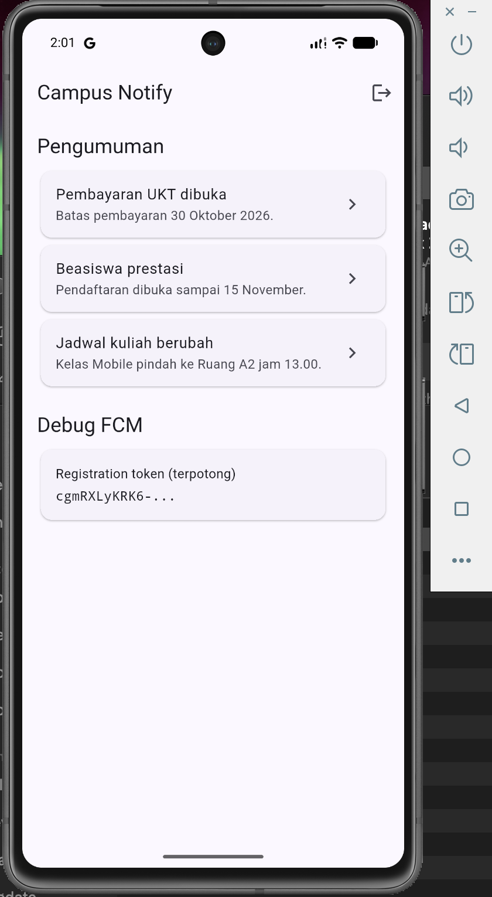
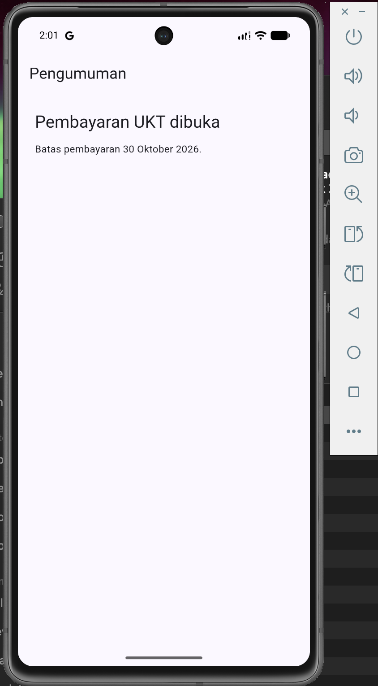

# Week 7 — Clean Architecture (Flutter)

Laporan praktikum minggu 7 mata kuliah Mobile Programming.
Refactor project **campus_notify** (Minggu 6) menjadi Clean Architecture
feature-first.

Nama: Ahmad Kevin Malik
NIM: 244107020125

---

## Tujuan

- Menjelaskan prinsip SOLID dan separation of concerns pada kode Flutter.
- Membedakan struktur feature-first vs layer-first beserta trade-off-nya.
- Memisahkan project menjadi tiga layer: presentation, domain, data, dengan
  aturan dependensi mengarah ke dalam.
- Membedakan entity vs model serta peran repository, use case, dan DI.
- Merefactor project Minggu 6 (`campus_notify`) menjadi struktur feature-first
  tanpa mengubah perilaku aplikasi.
- Menguji use case dengan repository palsu tanpa database atau jaringan.

## Catatan awal

Ini **refactor**, bukan project baru. Titik awal adalah salinan `campus_notify`
Minggu 6 yang diletakkan apa adanya ke folder ini (commit snapshot
`chore: snapshot before clean architecture`), sehingga struktur folder masih
lama (`data/`, `providers/`, `pages/`, `messaging/`).

Karena ini refactor, **UI tidak berubah**. Bukti keberhasilan justru: aplikasi
berjalan identik sebelum dan sesudah refactor, sementara struktur dan arah
dependensi berubah.

---

## Praktikum 1 — Audit layer project lama

### 1. Pemetaan file ke layer

Peta setiap file lama ke layer seharusnya, beserta masalahnya.

| File | Layer saat ini | Masalah |
|---|---|---|
| `lib/main.dart` | entrypoint / wiring | Menginisialisasi FCM dan push langsung di `main`; sebagian wiring bercampur dengan bootstrap. |
| `lib/router.dart` | presentation (routing) | OK — hanya membaca `authStateProvider` lewat `ref.read`; tidak menyentuh data. |
| `lib/routes.dart` | core (murni) | OK — tanpa dependensi Flutter; `routeFromMessage()` adalah fungsi murni yang teruji. |
| `lib/pages/login_page.dart` | presentation | Mengimpor `../data/api_errors.dart` langsung — lompat lewat domain. |
| `lib/pages/home_page.dart` | presentation | Mengimpor `../data/announcements.dart` langsung; daftar pengumuman dibaca dari data, bukan lewat provider/use case. |
| `lib/pages/announcement_page.dart` | presentation | Memanggil `announcementById(id)` dari `data/` langsung — presentation bergantung ke data. |
| `lib/providers/auth_provider.dart` | presentation (state) | Wiring DI, `AuthNotifier`, **dan** instalasi Dio/`TokenStore` tercampur. Mengimpor `package:dio` langsung. |
| `lib/providers/push_provider.dart` | presentation (state) | OK secara peran, tetapi lokasinya lintas-fitur (bukan milik satu fitur). |
| `lib/data/announcements.dart` | data (tercampur domain) | `Announcement` adalah **entity murni** (tanpa mapping) tapi tinggal di `data/`. List mock + `announcementById()` berperan sebagai repository. |
| `lib/data/auth_repository.dart` | data (tercampur domain) | `AuthSession` adalah entity murni; `AuthRepository` belum punya interface terpisah; melempar `Exception` mentah. |
| `lib/data/token_store.dart` | data (infrastruktur) | Dipakai lintas-fitur (auth + api_client); bukan milik satu fitur. |
| `lib/data/api_client.dart` | data (infrastruktur) | `buildApiClient()` adalah infrastruktur HTTP, bukan data satu fitur. |
| `lib/data/api_errors.dart` | data (infrastruktur) | `messageForError()` memetakan error → pesan; belum memakai `Failure`. |
| `lib/messaging/push_service.dart` | infrastruktur lintas-fitur | Bukan fitur bisnis; tidak boleh dipaksa masuk `features/`. |

### 2. Tiga grep pelanggaran klasik

Perintah sesuai codelab, dijalankan dari root project. Folder `lib/widgets`
belum ada, jadi pemeriksaan diarahkan ke `lib/pages` dan `lib/providers`.

```bash
# Widget yang menyentuh jaringan / database langsung
rg "Dio\(|http\.|openDatabase|SharedPreferences\.getInstance|FlutterSecureStorage" lib/pages lib/providers

# Logika bisnis di dalam build()
rg "DateFormat|jsonDecode|\.toIso8601String" lib/pages lib/providers

# Instansiasi manual (DI bocor)
rg "Repository\(|Dio\(BaseOptions|TokenStore\(" lib/pages lib/providers
```

Hasil:

| Pemeriksaan | Hasil | Keterangan |
|---|---|---|
| Jaringan / database di presentation | **0 hasil** | Widget tidak pernah menyentuh Dio/SQLite/secure storage secara langsung. |
| Logika bisnis di `build()` | **0 hasil** | Tidak ada parsing JSON atau formatting tanggal di widget. |
| Instansiasi manual (DI bocor) | **2 hasil** | `TokenStore()` dan `AuthRepository()` dibuat di dalam `lib/providers/auth_provider.dart`. |

Temuan grep 3:

```
lib/providers/auth_provider.dart:8   final tokenStoreProvider = Provider<TokenStore>((ref) => TokenStore());
lib/providers/auth_provider.dart:11  Provider<AuthRepository>((ref) => AuthRepository());
```

Grep 1 & 2 nol **bukan berarti bebas masalah**. Karena grep di atas hanya
mencari API mentah, pelanggaran yang sebenarnya terletak pada **arah import**.
Audit import yang diperluas menemukan:

| Temuan | Lokasi | Sifat pelanggaran |
|---|---|---|
| presentation impor `data/` langsung | `home_page.dart:5`, `announcement_page.dart:3`, `login_page.dart:4` | Melompati domain (presentation → data). |
| provider (presentation) menyentuh infra | `auth_provider.dart:1,4,5,6` (`package:dio`, `api_client`, `token_store`) | Wiring data bercampur dengan state presentation. |
| entity murni di dalam `data/` | `announcements.dart:2` (`Announcement`), `auth_repository.dart:2` (`AuthSession`) | Entity seharusnya hidup di `domain`. |
| exception mentah dilempar dari data | `auth_repository.dart:23,35` | Exception bocor ke presentation; harus menjadi `Failure`. |
| data bercampur infrastruktur lintas-fitur | `api_client.dart`, `token_store.dart`, `api_errors.dart`, `messaging/push_service.dart` | Infrastruktur bukan data satu fitur; tempatnya di `core/`. |

### 3. Struktur target

```
lib/
├── core/                             # kernel murni (tanpa framework)
│   └── failures.dart                 # sealed Failure — murni Dart
├── infrastructure/                   # adapter framework lintas-fitur
│   ├── network/
│   │   ├── api_client.dart           # buildApiClient (Dio + interceptor refresh)
│   │   ├── api_error_mapper.dart     # error -> Failure
│   │   └── api_providers.dart        # apiClientProvider (composition root)
│   └── messaging/
│       ├── push_service.dart         # handler FCM lintas-fitur
│       └── push_provider.dart        # fcmTokenProvider
├── features/
│   ├── auth/
│   │   ├── domain/
│   │   │   ├── entities/auth_session.dart
│   │   │   ├── repositories/auth_repository.dart      # interface
│   │   │   ├── repositories/session_repository.dart   # interface
│   │   │   └── usecases/login.dart
│   │   ├── data/
│   │   │   ├── datasources/auth_api.dart              # backend auth tiruan
│   │   │   └── repositories/
│   │   │       ├── auth_repository_impl.dart
│   │   │       └── session_repository_impl.dart
│   │   └── presentation/
│   │       ├── providers/auth_providers.dart          # DI + AuthNotifier
│   │       └── pages/login_page.dart
│   └── announcements/
│       ├── domain/
│       │   ├── entities/announcement.dart
│       │   ├── repositories/announcement_repository.dart   # interface
│       │   └── usecases/get_announcements.dart
│       ├── data/
│       │   └── repositories/announcement_repository_impl.dart
│       └── presentation/
│           ├── providers/announcement_providers.dart
│           └── pages/
│               ├── home_page.dart
│               └── announcement_page.dart
├── routes.dart                       # konstanta rute + routeFromMessage() (murni)
├── router.dart                       # GoRouter + guard auth
└── main.dart                         # bootstrap + wiring push
```

> **Catatan penempatan `core` vs `infrastructure`.** Grep sterilitas domain
> memeriksa `lib/features/*/domain` **dan** `lib/core`. Karena `import
> 'package:flutter` juga cocok untuk `package:flutter_secure_storage` (dan
> `package:flutter_riverpod`), menaruh adapter framework di dalam `core` akan
> membuat grep tersebut berisi hasil. Karena itu `core` dijaga murni Dart, dan
> adapter framework lintas-fitur (network, storage, messaging) diletakkan di
> `lib/infrastructure/`.

### Arah dependensi (aturan emas)

```
presentation ──▶ domain ◀── data
     │              ▲          │
     │              │          │
  (UI, provider) (entity,   (model?, impl,
                  interface,  Dio, storage)
                  use case)
```

- `presentation` hanya bergantung ke `domain`.
- `data` mengimplementasikan interface `domain`.
- `domain` **tidak tahu** Flutter, Dio, SQLite, atau Firebase.
- `core` menampung hal lintas-fitur; tidak bergantung ke `features`.

### Keputusan arsitektur (dicatat untuk penilaian)

| # | Keputusan | Alasan |
|---|---|---|
| 1 | Auth memakai use case `Login` | Menggabungkan dua langkah (panggil repository + simpan token), jadi punya alasan bisnis untuk berdiri sendiri. |
| 2 | Announcements memakai use case `GetAnnouncements` | Secara murni engineering ini passthrough satu baris (over-engineering), tetapi dipakai **demi konsistensi** pola antar fitur dan didokumentasikan sebagai pilihan sadar. |
| 3 | `token_store` di `lib/infrastructure/storage/` (via `SessionRepository` domain) | Dipakai auth **dan** `api_client`; bila ditaruh di `features/auth`, `core`/infra malah bergantung ke feature (arah panah salah). |
| 4 | `api_client`, `api_error_mapper`, `push_service` di `lib/infrastructure/` | Infrastruktur lintas-fitur, bukan fitur bisnis. Ditaruh di luar `core` agar grep sterilitas domain+core tetap nol. |
| 5 | `Failure` berupa `sealed class` + `LocalFailure`/`NetworkFailure` | Sesuai codelab; mendukung pattern matching. |
| 6 | `routes.dart` & `router.dart` tetap di root `lib/` | `routes.dart` sudah murni dan teruji; tidak diutak-atik. |
| 7 | Test lama ikut refactor + tambah 2 test use case | Mengikuti perpindahan file dan memenuhi syarat "minimal 2 test". |
| 8 | **Tidak** membuat `Model` untuk announcements/auth | Datanya mock in-memory tanpa serialisasi JSON/SQLite; model passthrough kosong = over-engineering. Entity dipakai langsung. |

---

## Praktikum 2 — Domain dan data per fitur

Dibuat dua fitur lengkap (domain + data). File lama **belum** dihapus pada
tahap ini; keduanya hidup berdampingan sampai Praktikum 3 memindahkan
presentation.

### Fitur announcements

- `domain/entities/announcement.dart` — entity murni `Announcement`
  (id, title, body), tanpa import Flutter dan tanpa mapping.
- `domain/repositories/announcement_repository.dart` — interface
  `AnnouncementRepository` (`fetchAnnouncements`, `fetchById`).
- `domain/usecases/get_announcements.dart` — use case `GetAnnouncements`.
- `data/repositories/announcement_repository_impl.dart` — implementasi dengan
  data mock in-memory. Entity dipakai langsung (tanpa model) karena tidak ada
  serialisasi JSON/SQLite.

### Fitur auth

- `domain/entities/auth_session.dart` — entity murni `AuthSession`
  (access, refresh).
- `domain/repositories/auth_repository.dart` — interface `AuthRepository`
  (`authenticate`, `refresh`).
- `domain/repositories/session_repository.dart` — interface `SessionRepository`
  (`save`, `readAccess`, `readRefresh`, `clear`).
- `domain/usecases/login.dart` — use case `Login` yang **menggabungkan** dua
  repository: autentikasi ke server lalu simpan sesi ke perangkat.
- `data/datasources/auth_api.dart` — backend auth tiruan (kontrak token).
- `data/repositories/session_repository_impl.dart` — implementasi
  `SessionRepository` dengan `FlutterSecureStorage`.
- `data/repositories/auth_repository_impl.dart` — implementasi `AuthRepository`
  di atas `AuthApi`, menerjemahkan exception menjadi `Failure`.

### Mengapa use case, dan mengapa `SessionRepository` terpisah

`Login` benar-benar menggabungkan lebih dari satu langkah (autentikasi +
persistensi sesi), jadi use case di sini punya alasan bisnis untuk berdiri
sendiri. Penyimpanan sesi dibuat sebagai **port terpisah** (`SessionRepository`)
alih-alih disembunyikan di dalam `AuthRepositoryImpl`, supaya use case dapat
mengoordinasikan keduanya tanpa domain menyentuh secure storage secara langsung
(domain tetap bebas framework). Untuk `GetAnnouncements` yang passthrough, use
case tetap dipertahankan demi konsistensi pola dan dicatat sebagai pilihan
sadar (lihat tabel keputusan #2).

### Verifikasi tahap ini

```bash
flutter analyze   # 0 error/warning (hanya 1 info package_names baseline)
flutter test      # 19 test lama masih lolos (kode lama belum dihapus)

# Domain + core steril dari framework (harus NOL hasil)
rg "import 'package:flutter|import 'package:dio|import 'package:sqflite|import 'package:firebase" lib/features/*/domain lib/core
```

Hasil grep sterilitas: **0 hasil** — domain dan core bebas dari Flutter, Dio,
SQLite, dan Firebase.

## Praktikum 3 — Presentation, DI, dan verifikasi

Pada tahap ini seluruh presentation dipindahkan ke dalam fitur, wiring DI
dipusatkan, dan file lama dihapus.

### DI dengan Riverpod

Wiring terpusat hanya di provider. Widget tidak pernah membuat repository
sendiri.

- `features/auth/presentation/providers/auth_providers.dart` — menyediakan
  `sessionRepositoryProvider`, `authRepositoryProvider`, `loginProvider`, dan
  `authStateProvider` (`AuthNotifier`). Notifier memanggil **use case `Login`**,
  bukan repository langsung.
- `features/announcements/presentation/providers/announcement_providers.dart` —
  `announcementRepositoryProvider`, `getAnnouncementsProvider`,
  `announcementsProvider`, dan `announcementByIdProvider` (family).
- `infrastructure/network/api_providers.dart` — `apiClientProvider` sebagai
  composition root untuk Dio (agar presentation bebas `package:dio`).

### Halaman hanya membaca state

- `home_page.dart` memakai `ref.watch(announcementsProvider)` dan merender
  `AsyncValue` (loading/error/data). Tidak ada lagi pembacaan `announcements`
  dari `data/` secara langsung.
- `announcement_page.dart` memakai `announcementByIdProvider(id)` — satu sumber
  data untuk daftar maupun deep link.
- `login_page.dart` memanggil `authStateProvider.notifier.login(...)`.

### Perpindahan file

| Lama | Baru |
|---|---|
| `lib/data/auth_repository.dart` | dipecah ke `features/auth/domain/*` + `data/*` |
| `lib/data/announcements.dart` | dipecah ke `features/announcements/domain/*` + `data/*` |
| `lib/data/token_store.dart` | `features/auth/data/repositories/session_repository_impl.dart` |
| `lib/data/api_client.dart` | `infrastructure/network/api_client.dart` |
| `lib/data/api_errors.dart` | `infrastructure/network/api_error_mapper.dart` |
| `lib/messaging/push_service.dart` | `infrastructure/messaging/push_service.dart` |
| `lib/providers/push_provider.dart` | `infrastructure/messaging/push_provider.dart` |
| `lib/providers/auth_provider.dart` | `features/auth/presentation/providers/auth_providers.dart` |
| `lib/pages/*.dart` | `features/*/presentation/pages/*.dart` |
| `lib/data`, `lib/providers`, `lib/pages`, `lib/messaging` | **dihapus** |

`main.dart`, `router.dart`, dan `routes.dart` tetap di root `lib/` dengan import
yang disesuaikan.

### Verifikasi dependency rule

```bash
# 1. Presentation steril dari data mentah (harus NOL hasil)
rg "Dio\(|openDatabase|getDatabasesPath|FlutterSecureStorage|SharedPreferences\.getInstance|jsonDecode" lib/features/*/presentation

# 2. Domain steril dari framework & package (harus NOL hasil)
rg "import 'package:flutter|import 'package:dio|import 'package:sqflite|import 'package:firebase" lib/features/*/domain lib/core

# 3. Static analysis + test
flutter analyze
flutter test
```

Hasil:

| Verifikasi | Hasil |
|---|---|
| Grep 1 (presentation steril) | **0 hasil** ✅ |
| Grep 2 (domain + core steril) | **0 hasil** ✅ |
| `flutter analyze` | **0 error/warning** (1 info `package_names` baseline) ✅ |
| `flutter test` | **24 test lolos** ✅ |
| `flutter build apk --debug` | **berhasil** ✅ |

## Pengujian

### Unit test

```bash
flutter test
```

Hasil: **24 test lolos**.

| File | Cakupan |
|---|---|
| `test/deep_link_test.dart` | `routeFromMessage()` + `AppRoute.announcementOf()` |
| `test/auth_test.dart` | `AuthRepositoryImpl` (authenticate/refresh) + `messageForError()` (401/404/5xx/timeout/connection/Failure) |
| `test/refresh_test.dart` | interceptor Dio: refresh sekali lalu ulang, refresh mati → `onSessionExpired` + bersihkan sesi, 401 berulang tidak loop |
| `test/get_announcements_test.dart` | **use case `GetAnnouncements` dengan repository palsu** (sukses + failure) |
| `test/login_test.dart` | **use case `Login` dengan repository palsu** (sukses menyimpan sesi + gagal tidak menyimpan) |

Dua test terakhir menguji domain murni — tanpa SQLite, Dio, atau Firebase —
memakai `FakeAnnouncementRepository`, `_FakeAuthRepository`, dan
`_FakeSessionRepository` yang mengimplementasikan interface domain.

### Verifikasi manual (behavior identik)

Aplikasi dijalankan dan diuji manual: login, daftar pengumuman, detail
pengumuman, logout, serta alur notifikasi. Tampilan **identik** dengan Minggu 6
— sesuai definisi selesai codelab, refactor tidak mengubah perilaku.

## Bukti (Screenshots)

Semua bukti ada di `screenshots/`.

### Perubahan struktur

| Before (Minggu 6) | After (final) |
|---|---|
|  |  |

- `01-struktur-before.png` — struktur lama (`data/ providers/ pages/ messaging/`).
- `02-struktur-setelah-prak2.png` — setelah Praktikum 2 (`core/` + `features/`).
- `06-struktur-after-final.png` — struktur final (`core/` + `infrastructure/` + `features/`).

### Verifikasi dependency rule (grep sterilitas)

| Presentation steril | Domain + core steril |
|---|---|
|  |  |

### Analisis statis & test

| `flutter analyze` | `flutter test` |
|---|---|
|  |  |

### Bukti UI (behavior identik before/after)

| Login | Home (daftar pengumuman) | Detail pengumuman |
|---|---|---|
|  |  |  |

Tampilan identik dengan Minggu 6 — UI tidak berubah, hanya struktur dan arah
dependensi kode yang berubah.

## AI Challenge

Prompt, usulan AI, tabel usulan-vs-keputusan-final, checklist verifikasi, dan
hasil tiga grep sterilitas didokumentasikan di
[docs/ai-challenge.md](docs/ai-challenge.md).

## Cara Menjalankan

```bash
flutter pub get
flutter run
```

Kredensial login mock:

- Email: `mahasiswa@kampus.ac.id`
- Kata sandi: `rahasia123`

## Refleksi

**1. Mengapa interface repository harus tinggal di domain, bukan di data? Apa yang rusak bila dibalik?**

Interface adalah **kebutuhan domain**: domain-lah yang mendefinisikan operasi
apa yang dibutuhkannya (mis. "ambil daftar pengumuman"), tanpa peduli caranya.
Bila interface diletakkan di `data`, arah dependensi terbalik: `domain` harus
mengimpor `data` untuk memakai kontraknya. Akibatnya domain ikut menyeret
seluruh isi layer data (Dio, SQLite, Firebase) dan kehilangan kemampuan diuji
murni — test use case jadi butuh implementasi data sungguhan. Prinsip Dependency
Inversion menyatakan modul tingkat tinggi (domain) yang memiliki abstraksi,
sedangkan modul tingkat rendah (data) yang mengikutinya. Menaruh interface di
data membalik aturan itu dan meruntuhkan alasan utama Clean Architecture.

**2. Kapan use case benar-benar dibutuhkan, dan kapan repository langsung ke notifier sudah cukup?**

Use case dibutuhkan saat operasi **menggabungkan lebih dari satu langkah atau
punya aturan bisnis** — validasi, sorting, sinkronisasi, atau koordinasi
beberapa repository. Contoh di project ini: `Login` menggabungkan autentikasi ke
server **dan** persistensi sesi ke perangkat, jadi ia layak berdiri sendiri.
Sebaliknya, operasi passthrough satu baris (mis. "ambil semua pengumuman" tanpa
aturan tambahan) cukup diteruskan repository langsung ke notifier; menambah use
case di situ hanya menambah file tanpa nilai. Aturan praktisnya: use case mulai
wajib ketika ada logika yang tidak pantas ditaruh di notifier (presentation)
maupun di repository (data).

**3. Apa biaya over-engineering (use case per CRUD satu-baris) bagi tim kecil? Kapan biayanya sepadan?**

Biayanya: lebih banyak file dan lapisan untuk dibaca, navigasi kode lebih jauh
untuk perubahan sepele, dan beban maintenance — setiap penambahan field berarti
menyentuh entity, repository, use case, dan provider. Untuk tim kecil dengan
fitur CRUD sederhana, ini memperlambat tanpa memberi keuntungan yang sepadan.
Biaya itu **sepadan** ketika: (a) logika bisnis mulai tumbuh dan perlu diuji
terpisah dari UI, (b) fitur dipakai di beberapa tempat sehingga duplikasi logika
mahal, atau (c) project berumur panjang dan akan dipegang banyak orang, sehingga
batas antar layer justru menghemat waktu jangka panjang. Kuncinya bukan "selalu
pakai use case", melainkan memakai use case ketika ada alasan nyata.

**4. Bagian mana dari usulan AI yang Anda tolak atau sederhanakan, dan mengapa?**

Dua hal disederhanakan: (a) **tidak membuat `Model`** terpisah untuk
announcements dan auth. Data keduanya mock in-memory tanpa serialisasi
JSON/SQLite, sehingga model hanya akan menjadi kelas passthrough kosong — murni
over-engineering. Entity dipakai langsung karena tidak ada batas serialisasi
yang perlu dilindungi. (b) **`GetAnnouncements` yang passthrough** tetap
dipertahankan tetapi secara sadar dicatat sebagai pilihan konsistensi, bukan
kebutuhan — berbeda dengan `Login` yang benar-benar menggabungkan dua langkah.
Selain itu, penempatan adapter framework dipindahkan dari `core/` ke
`lib/infrastructure/` agar `core` tetap murni Dart dan lolos grep sterilitas
domain. Detail lengkap ada di [docs/ai-challenge.md](docs/ai-challenge.md).
